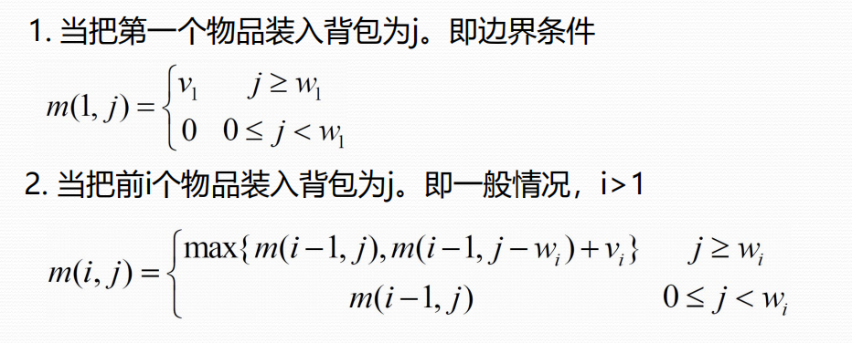

# 高级算法设计与分析

[TOC]


>1.单选题：5道，每道5分
>
>2.简答题：5道，每道5分
>
>3.算法设计与分析题：5道，每道10分。要求设计算法、求解过程与结果、伪码、复杂度分析等。

## 1、算法设计与分析基础概念（书第一章），学会分析渐进符号

**给定计算问题，算法是一系列良定义的计算步骤**

- **算法的性质**

  1. 有穷性
  2. 确定性
  3. 可行性

- 算法的表示

  

- 算法的分析

  

  

  

  

## 2、各算法、理论的基本思想、步骤、特点、适用情况（所解决的问题）、复杂度分析；算法之间的关系和区别，学会用基本思想来设计算法

### 2.1 分治法

> **分而治之**，主要分为两部分，首先就是将原本规模较大的问题不断拆分，缩小子问题规模，达到最优子结构。然后合并，在合并过程中，应为子问题足够小，容易计算，再不断合并子问题答案，最终求出问题解，这就是所谓的分治法

- **分治法的适用情况**

  1. 该问题的规模缩小到一定的程度就可以容易解决
  2. 该问题可以分解为若干个规模较小的相同问题，即该问题具有最优子结构性质
  3. 利用该问题分解出的子问题的解可以合并为该问题的解
  4. 该问题所分解出的各个子问题是相互独立的，即子问题之间不包含公共的子问题

- **复杂度分析**

  一个分治法将规模为n的问题分成k个规模为n/m的子问题去解。将原问题分解为k个子问题以及用merge将k个子问题的解合并为原问题的解需用f(n)个单位时间。
  $$
  T(n) = kT(n/m)+f(n)
  $$
  
- **步骤**


[代表例子：归并排序](#3.1 归并排序)

------


### 2.2 动态规划

> **动态规划**，与分治法类似，基本思想也是将待求解问题分解为若干个子问题，但得到的各个子问题不是相互独立的，动态规划的思想就是减少子问题的重复计算

**解决步骤**

````mermaid
graph LR;
		A(找出最优解的性质刻画结构特征)-->B(递归地定义最优值)-->C(自底向上计算最优值)-->D(根据得到的信息构造最优解)
````

**算法特点：**

1. 阶段性
2. 无后向性

**时间复杂度分析**

1. 状态数和状态转移数较小的情况：在状态数和状态转移数较小的情况下，动态规划的时间复杂度通常为O(n^2)，其中n表示状态数。
2. 状态数和状态转移数较大的情况：动态规划的时间复杂度通常为O(nm),其中n表示状态数，m表示状态转移数，这种情况需要使用一些优化技巧来减少计算量，例如记忆化搜索、滚动数组等

**动态规划法的适用情况**

动态规划常常适用于有重叠子问题和最优子结构性质的问题，并且记录所有子问题的结果

**代表例子：**

[最长公共子序列](#6、最长公共子序列问题)

[0-1背包问题](#7.1 动态规划)

------


### 2.3 贪心算法

**基本要素**

- 贪心选择性质
- 最优子结构性质

**解决步骤**

1. 产生问题的一个初始解
2. 循环操作
3. 得到问题的最优解

**适用情况**

该问题局部最优策略能导致产生全局最优解

**代表例子**

[霍夫曼编码](#9、霍夫曼编码)

[活动安排问题](#5、活动安排问题)

------


### 2.4 回溯法

> **回溯法**的基本方法就是搜索，是一种组织得井井有条的，能避免不必要搜索的穷举式搜索法
>
> 按深度优先策略，从根节点搜索整个解空间树，但是加了一个条件，如果不包含问题的解就返回到父节点对该节点的兄弟节点搜索

| name         | description                          | name   | description                   |
| ------------ | ------------------------------------ | ------ | ----------------------------- |
| 问题的解向量 | 回溯法希望问题的解能表示成一个n元组  | 显约束 | 对分量Xi的取值限定            |
| 隐约束       | 为满足问题的解而对不同分支施加的约束 | 解空间 | 满足显约束n元组，组成了子空间 |
| 扩展节点     | 正在产生子节点                       | 活节点 | 子节点没有全部生成            |
| 死节点       | 子节点已全部产生                     |        |                               |

**解决步骤**

1. 选择路径
2. 探索路径
3. 撤销选择
4. 终止条件

**适用情况**

该问题是求解组合数量较大；需要找出该问题的解集（全部解）或者要求回答什么解是满足某些约束条件的最优解。

**代表例子：**

[0-1背包问题](#7.2 回溯法)

------


### 2.5 分支限界法

> **分支界限法**类似于回溯法，是在问题的解空间树上搜索问题解的算法，一般情况下与回溯法的求解目标不同，采用广度优先或最小消耗优先的方式搜索解空间树
>
> - 回溯法：求出解空间树中满足约束条件的所有解，深度优先
> - 分支界限法：找出满足约束条件的一个解，或最优解，广度优先

**分支就是采用广度优先的策略，依次生成扩展节点的所有分支，限界就是在扩展的过程中，去掉某些不需要的分支**

**适用情况**

该问题是求解组合数量较大；需要找出该问题的解集（全部解）或者要求回答什么解是满足某些约束条件的最优解。

**代表例子：**

[0-1背包问题](#7.3 分支限界法)


### 2.6 各算法之间的比较

|        | 分治法和动态规划法                                           | 动态规划法和贪心法                                           | 回溯法和分支限界法                                           |
| ------ | ------------------------------------------------------------ | ------------------------------------------------------------ | ------------------------------------------------------------ |
| 共同点 | 二者都要求原问题具有最优子结构性质，都将原问题分成若干个子问题，然后将子问题的解合并，形成原问题的解 | 贪心算法和动态规划算法都要求问题具有最优子结构性质           | 一种在问题的解空间树上搜索问题解的算法                       |
| 不同点 | 动态规划法是将待求解问题分解成若干个相互重叠的子问题，而分治法是分解成若干个互不相交的子问题。利用分治法求解，这些子问题的重叠部分被重复计算多次。而动态规划法将每个子问题只求解一次并讲其保存在一个表格中，当需要再次求解此子问题时，只是简单地通过查表获得该子问题的解，从而避免了大量的重复计算 | 动态规划法用到之前的最优解，贪心则不是，贪心无法解决动态规划的问题，但是动态规划能解决贪心的问题。虽然能够应用贪心算法一定能够应用动态规划法，但是一般来说，贪心算法的效率高于动态规划法，因而还是应用贪心算法。动态规划算法通常以自底向上的方式解各子问题，而贪心算法则通常以自顶向下的方式进行，以迭代的方式作出相继的贪心选择，每做一次贪心选择就将所求问题简化为规模更小的子问题 | 求解目标不同，回溯法的目标是找出解空间树满足约束条件的所有解，而分支限界法的求解目标是尽快地找出满足约束条件的一个解；搜索方法不同，回溯法采用深度优先方法搜索解空间，而分支限界法一般采用广度优先或以最小消耗优先的方式搜索解空间树；对扩展结点的扩展方式不同，回溯法中，如果当前的扩展结点不能够再向纵深方向移动，则当前扩展结点就成为死结点，此时应回溯到最近一个活结点处，并使此活结点成为扩展结点。分支限界法中，每一次活结点只有一次机会成为扩展结点。活结点一旦成为扩展结点，就一次性产生其所有儿子结点；存储空间的要求不同，分支限界法的存储空间比回溯法大得多，当内存容量有限时，回溯法成功的可能性更大 |


## 3、数组排序问题

### 3.1 归并排序

**伪代码**

```python
def MergeSort(A,left,right):
    input: A[1...n],left,right
    output: sorted A[left...right]
    process:
        if left >= right then:
            return A[left...right]
        end
        mid <- [(left+right)/2]
        MergeSort(A,left,mid)
        MergeSort(A,mid+1,right)
        Merge(A,left,mid,right)
        return A[left....right]
def Merge(A,left,mid,right)
	input: A[1...n],left,mid,right
    output: A[left....right]
    process:
        A'[left....right] <- A[left....right]
        i <- left,j <- mid+1,k <- 0
        while i<=mid and j <= right do
        	if A'[i]<=A'[j] then
            	A[left + k] <- A'[i]
                k <- k+1,i <- i+1
       		else 
            	A[left + k] <- A'[j]
                k <- k+1,j <- j+1
        end
        if i <= mid then
        	A[left+k....right] <- A'[i...mid]
        else
        	A[left+k...right] <- A'[j....right]
        end
        return A[left....right]
```

**复杂度分析**


### 3.2 快速排序

**伪代码**

```python
#QuickSort(A,start,end)
input:A,start,end
output:A
if start < end then:
    q <- Partition(A,start,end)
    QuickSort(A,start,q-1)
    QuickSort(A,q+1,end)
end

#Partition(A,start,end)
input:A,start,end
output:位置p
x <- A[end]
i <- start-1
for j <- start to end-1 do:
    if A[j] <= x then:
        swap(A[i+1],A[j])
    end
swap(A[i+1],A[end])
return i+1
```

**时间复杂度分析O(nlogn)**


## 4、选择第K小问题

**使用快速排序的思想**

```python
#Partition(A,start,end)
input:A,start,end
output:位置p
x <- A[end]
i <- start-1
for j <- start to end-1 do:
    if A[j] <= x then:
        swap(A[i+1],A[j])
    end
swap(A[i+1],A[end])
return i+1
```

```python
#Selection(A,start,end,K)
input:A,start,end,k
output:第k小的元素
q <- Partition(A,start,end)
if k = q-start+1 then:
    x <- A[q]
end
if k < q-start+1 then:
    x <- Selection(A,start,q-1,k)
end
if k > q-start+1 then:
    x <- Selection(A,q+1,end,k-(q-p+1))
end
return x
```

**时间复杂度分析**
$$
O（nlogn）
$$


## 5、活动安排问题

> 对活动时间进行安排，保证场地的出租时间不能冲突，怎样才能选更多的活动

- 提出贪心策略
  - 最短活动优先
  - 最早开始活动优先
  - 最早结束活动优先
- 证明策略正确
  - 错误
  - 错误
  - 正确

```python
input:活动集合S={a1,a2,...,an},每个活动的起止时间s[i],f[i]
output:不冲突活动的最大子集S'
process:
    将活动按照结束时间升序排序
    S' <- {a1}
    k <- 1
    for i <- 2 to n do:
        if s[i] >= f[k] then:
            S' <- S' $\cup$ {ai}
            k <- i
        end
    end
    return S'
```

$$
时间复杂度：O(nlogn)
$$


## 6、最长公共子序列问题

> **问题描述:**
>
> 当一个序列Z在另外一个序列A中存在一个严格递增下标序列{i~1~,i~2~,....,i~k~}，使得Z~j~=A~i~~j~
>
> 例如：Z={B,C,D,B}是序列X={A,B,C,B,D,A,B}的子序列
>
> 当Z即为A的子序列又为B的子序列时，称Z为A和B的公共子序列

1. **最长公共子序列的结构**

   

2. **最优值的递归定义**

   

3. **自底向上方式求最优值**

   共有mn个子问题，对这些子问题进行求解，并保存每个点的具体类型到另外一个矩阵中，需要注意我们在构造矩阵时加了一个维度，防止数组访问越界

4. **构造最优解**

   通过代码输出最长公共子序列

**code:**

```python
input:x[1....n],y[1....m]为两个初始输入数组
output:c[1....n][1....m],b[1....n][1....m]C为记录序列最长的公共子序列的长度，B为构造最优解的辅助数组
process:
    for i <- 1 to n do:
        c[i][0] <- 0
    end
    for j <- 1 to m do:
        c[0][j] <- 0
    end
    for i <- 0 to n do:
        for j <- 0 to m do:
        	if(x[i]=y[j]):
            	c[i][j] = c[i-1][j-1]+1
            	b[i][j] = 1
        	elif(c[i-1][j] >= c[i][j-1]):
            	c[i][j] = c[i-1][j]
            	b[i][j] = 2
        	else:
            	c[i][j] = c[i][j-1]
            	b[i][j] = 3
```

```python
input:b[1...n][1...m]上面代码的辅助数组
output:res[]最长公共子序列
process:
    i,j,k <- 0
    while(i != 0 and j != 0):
        if(b[i][j] == 1):
            res[k] <- x[i]
            i <- i-1,j <- j-1,k <- k+1
        elif(b[i][j] == 2):
            i <- i-1,j<-j
        else:
            i <- i,j <- j-1
```

**时空复杂度分析：**
$$
时间复杂度：O(n^2)\\
空间复杂度：O(n^2)
$$
**例题**：

> 问题描述：X=【1,2,3】，Y=【1,3】

通过计算得到C矩阵为：

| X\Y  | NAN  | 1    | 3    |
| ---- | ---- | ---- | ---- |
|      | 0    | 0    | 0    |
| 1    | 0    | 1    | 1    |
| 2    | 0    | 1    | 1    |
| 3    | 0    | 1    | 2    |

通过计算得到矩阵B为：

| X\Y  | NAN  | 1    | 3    |
| ---- | ---- | ---- | ---- |
| NAN  | 0    | 0    | 0    |
| 1    | 0    | 1    | 3    |
| 2    | 0    | 2    | 2    |
| 3    | 0    | 2    | 1    |

从而得到最后计算得到的长度2，序列为{1,3}

## 7、0-1背包问题

### 7.1 动态规划

> 问题描述：给定n种物品和一背包，物品i的重量是w~i~,价值为v~i~,背包容量为C，如何装物品使得装入背包的物品总价值最大

1. 最优子结构性质分析

   当前i个物品装入容量为j的背包所获得的最大价值用m\[i][j]表示

   - 第i个物品的重量超过容量时，m\[i][j]=m\[i-1][j]
   - 第i个物品不超过容量时，m\[i][j]=max{m\[i-1][j],m\[i-1][j-wi]+vi}

2. 最优递归值的定义

   

3. 求最优值

4. 构造最优解

**code:**

```python
input:v[1....n],w[1....n],背包容量V
output:m[1....n][1....V]前i个物品装入容量为j的背包所能获得最大价值用m[i][j]来表示
process:
    for j <- 0 to n:
        if(j >= w[1]):
            c[0][j] <- v[i]
        else:
            c[0][j] <- 0
    for i <- 0 to n:
        for j <- 0 to V:
        	if(j < w[i]):
            	m[i][j] <- m[i-1][j]
        	else:
            	m[i][j] <- max(m[i-1][j],m[i-1][j-w]+v[i]) 
```

例子：


$$
时间复杂度:O(NV),显然两层循环外循环O(N)次,内循环O(V)次,总时间复杂度为O(NV)。\\

空间复杂度:O(NV)。
$$


### 7.2 回溯法

> 主要思想：先就该问题讨论其的解空间，从而可以得到子集树

- 输入物品的价值矩阵和重量矩阵，背包容量，得出问题的子集树

  

- 得到满足条件的可行解

- 计算得到最优解

```c++
int w[] = { 10, 20, 30, 40, 50, 60, 70, 80, 90, 100 };  // 物品重量数组
int v[] = { 1, 2, 3, 4, 5, 6, 7, 8, 9, 10 };  // 物品价值数组
bool selected[max_n]; // 记录物品是否被选择
int current_weight = 0;  // 当前已选物品的总重量
int max_value = 0; // 已找到的最大总价值
 
// backpack 函数用于搜索某一层的所有可能性
void backpack(int i) {
    if (i == max_n) {  // 如果已经遍历完所有物品，则更新 max_value
        if (current_weight <= capacity && max_value < v[i]) {
            max_value = v[i];
        }
        return;
    }
 
    if (current_weight + w[i] <= capacity) {  // 如果能将当前物品加入背包
        selected[i] = true;
        current_weight += w[i];
        backpack(i + 1);  // 进入下一层
        current_weight -= w[i];  // 递归返回后，需要将当前物品从已选物品中删除
        selected[i] = false;
    }
 
    backpack(i + 1);  // 进入下一层
}
```

**时空复杂度分析**

- 首先子集树结点为2^(N+1)-1^个即O(2^N^)个。在每个结点处都需要求解限界函数时间复杂度显然为O(N)。所以回溯的时间复杂度为O(N*2^N^)。而排序需要花费O(NlogN)时间在渐进意义下总时间复杂度为O(N*2^N^)。
- 搜索深度最多为n+1即O(N)而排序的栈空间开销为O(logN)渐进意义下的空间复杂度为O(N)


### 7.3 分支限界法

- 先对输入数据进行预处理，将各物品按照单位重量价值从大到小排列
- 计算初始点的ub=v+(W-w)*(v~i+1~/w~i+1~),放入优先队列

```python
input: 物品重量、价值矩阵，背包容量
output:背包最大价值
process:
    计算vi/wi并降序排列
    计算跟节点ub = v+(W-w)*(v[i+1]/w[i+1]),并放入优先队列
    repeat:
        从优先队列中取出最大的节点，作为下一个遍历点
        计算下一层各个节点的ub
        if 没有超出背包容量
        	加入到优先队列中
    until:遍历的节点为叶子节点
```

[比较好的完整解释链接](https://www.cnblogs.com/RB26DETT/p/10982687.html)

**时空复杂度分析**

- 时间复杂度与回溯法相同O(N*2^N^),但在实际情况不可能这么糟糕，因为会剪去非常多的枝条
- 空间复杂度O(2^N^),但同理在实际情况中我们会剪去非常多的枝条

## 8、最大子数组问题

> 问题描述：给定一个数组A，寻找A的和最大的非空连续子数组

**状态转移方程：**

```python
dp[i] = Math.max(nums[i],nums[i]+dp[i-1])
```

**思路：**

每当遍历到下一个元素，我们可以选择加入到上一个元素的最大子数组中，同时也可以将其独立出来，所以可以得到上面得到的状态转移方程，状态转移方程出来，其余问题迎刃而解

**Code:**

```python
input:nums[]初始数组
output:最大子数组的和
process:
    int n = nums.length;
    if (n == 0) return 0;
    int[] dp = new int[n];
    // 第一个元素前面没有子数组
    dp[0] = nums[0];
    // 状态转移方程
    for (int i = 1; i < n; i++) {
        dp[i] = Math.max(nums[i], nums[i] + dp[i - 1]);
    }
    // 得到 nums 的最大子数组
    int res = Integer.MIN_VALUE;
    for (int i = 0; i < n; i++) {
        res = Math.max(res, dp[i]);
    }
    return res;
```

**时间复杂度分析**
$$
O（N）
$$


## 9、霍夫曼编码

> 问题描述：构造最优前缀码

```python
input: 字符数n，各个字符频数F
output：霍夫曼编码树
process:
    将F递增排序
    新建节点数组P[1...n]和Q[1...n]
    for i <- 1 to n do:
        P[i].freq <- F[i]
        P[i].left <- NULL
        P[i].right <- NULL
    end
    Q <- []
    for i <- 1 to n-1 do:
        新建节点z
        x <- ExtractMin(P,Q)
        y <- ExtractMin(P,Q)
        z.freq <- x.freq + y.freq
        z.left <- x
        z.right <- y
        Q.Add(z)
    end
    return ExtractMin(P,Q)
```

时间复杂度：O（nlogn）

## 10、P问题，NP问题，NPC问题

[这篇文章的概念讲的很不错](http://www.matrix67.com/blog/archives/105)

### 10.1 P问题

> 在多项式时间内可以解决的问题


### 10.2 NP问题

> 给定一个解，可以在多项式时间内验证该解是否是问题的一个解的问题

### 10.3 NPC问题

> 是NP问题中最难的问题，包含两个条件
>
> - 是一个NP问题
> - 所有的NP问题都可以归约为此问题

### 10.4 三个问题之间的关系


## 11、在线算法和离线算法

### 11.1 在线算法

>一个在线算法是指它可以以序列化的方式一个个的处理输入，也就是说在开始时并不知道所有的输入。相对的，对于一个离线算法，在开始时就需要知道问题的所有输入数据，而且在解决一个问题后就要立即输出结果。

- **K服务问题**

  > 问题描述：给定一个图G，所有顶点为服务对象，k辆服务车按提出服务要求的先后次序来往于服务n个顶点之间，k辆车初始位置确定，服务是一个一个给出的
  >
  > 目标：移动的总距离较短

  使用贪心算法可能会导致，部分车辆过于繁忙，而部分车辆长时间空闲

  **竞争分析**

  通过与最优离线算法比较来评价在线算法的好坏

  **竞争比**

  

- **购买与租用问题**

  > 问题描述：可以花T元购买该商品的设备，也可以花1元租用生产该商品的设备
  >
  > 问题分析：如果能预先确定市场需求期，则能够确定
  >
  > 问题解决：选择一个整数K，在前K天租用设备，在K+1天购买设备

  当 k = 0时，在第一天就购买设备，此时 ，在 L=1时达到最坏情况。

  当 k = T-1 时，在前 T-1 天租用设备，而在第 T 天购买设备。

  如果 L< T , 则在线算法的耗费与最优离线算法的耗费相同。

  如果 L ≥ T，则在线算法的耗费为 T+ ( T-1 ) = 2T-1，而最优离线算法的耗费为 T 。

  此时在线算法是 竞争的。

### 11.2 页调度问题

> 系统软件在进行内存管理时，将内存分为高速缓存和低速缓存，所有会出现页面缺失的问题，需要我们用算法来确定交换的页面
>
> 评价指标：页面调度算法的耗费是指执行过程中页面缺失次数

- FIFO：先到先出算法
- LIFO：后到先出算法
- LRU： 最久未使用算法，将最近访问时间最早的页面换出
- LFU：将访问次数最少的页面换出
- OPT：调出的页应该是以后不再访问的页或距当前最长时间后再访问的页

### 11.3 负载均衡

- **基本思想**

  > 主要分为硬件负载均衡和软件负载均衡，类似Nginx实现了一种消息队列分发机制，简单来说就是把很多请求进行分流
  >
  > 目标：调度集群，达到最佳化资源使用，最大吞吐率，最小响应时间，避免单点过载的问题

  > 给m个机器n个任务，使负载尽可能均衡，最大负载达到最小

- **随机法**

  *使用随机函数，随机选择一台服务器来服务客户*

  优点：使用简单，不会给服务器太大压力

  缺点：当数据量大的时候才能保证均衡，请求量有限，可能达不到均衡，而且没有考虑到服务器性能差距

  适用：服务器能力相近，所需资源接近

- **轮询法**

  *适用于服务器性能相近的情况，其中每个服务器承载相同的负载，该算法遍历服务器节点列表，并按节点次序每轮选择一台服务器处理请求*

  优点：简单高效，易于水平扩展，每个节点满足字面意义上的均衡

  缺点： 没有考虑机器的性能问题，会让配置较差的服务器成为瓶颈

  适用：数据库或只读情景

- **加权轮询法**

  *在轮询法的基础上加入了权重，给配置高的服务器较大的负载，给配置低的服务器较低的权重*

  1. 普通加权轮询

     在服务器数组S中，计算出所有服务器权重的最大值，服务到来时找到其中权重大于等于最大值的第一个服务器，并给当前服务器权重减去所有服务器权重的最大公约数

     优点：考虑到了不同服务器的性能问题，让集群性能最大化

     缺点：权重大的服务器会在单位时间内分配到权重比例的请求数，这不是一种均匀的分配方法

  2. 平滑加权轮询法

     | 变量           | 含义                                 |
     | -------------- | ------------------------------------ |
     | weight         | 每个服务器的权重是固定不变的         |
     | current_weight | 服务器的目前权重，根据这个选择服务器 |
     | total          | weight的相加和                       |
     
     服务过来$\rightarrow$current_wieght+weight$\rightarrow$选择权重最高的服务器$\rightarrow$将该服务器的权重减去total
     
     优点：没有为权重大的服务器连续安排工作，同时也在权重较小的服务器中穿插
  

### 11.4 势函数分析

> 在不知道有多少个元素要加入一个哈希表 的情况下，如何建立哈希表


这个算法的总的时间代价为O(n),平均下来每次的平均代价为O(1)，证明过程如下：


**势能**

> 同物理上的概念类似，在数学上，每次将操作后的状态映射成一个实数，我们称之为实数值的势
>
> 势函数分析为计算某个在线算法的性能，提供了简单而强大的抽象算法

通过势函数对上面问题进行分析：


## 12、最长上升子序列问题

> **最长上升子序列**，简称LIS，也有些情况求的是最长非降序子序列，二者区别就是序列中是否可以有相等的数。假设我们有一个序列 b i，当b1 < b2 < … < bS的时候，我们称这个序列是上升的。对于给定的一个序列(a1, a2, …, aN)，我们也可以从中得到一些上升的子序列(ai1, ai2, …, aiK)，这里1 <= i1 < i2 < … < iK <= N，但必须按照从前到后的顺序。比如，对于序列(1, 7, 3, 5, 9, 4, 8)，我们就会得到一些上升的子序列，如(1, 7, 9), (3, 4, 8), (1, 3, 5, 8)等等，而这些子序列中最长的（如子序列(1, 3, 5, 8) ），它的长度为4，因此该序列的最长上升子序列长度为4。

- 状态设计：F[i]代表以A[i]结尾的LIS的长度

- 状态转移：F[i]=max{F[j]+1,F[i]}(1<=j<1,A[j]<A[i])
- 边界处理：F[i]=1(1<=i<=n)

```python
input:a[1...n]初始序列
output:最长子序列长度
process:
    f[1....n] <- 1
    for i <- 1 to n do:
        for j <- 1 to i do:
            if a[j] < a[i] then:
                f[i] = max(f[i], f[j]+1)
    for i <- 1 to n do:
        ans = max(ans, f[i])
    return ans
```

T(n) = O(n^2^)

## 结束语

> **Open source is a spirit that arises for freedom and equality.**
>
> *如发现内容错误，请联系编辑者进行修正，该内容仅针对2023级的重点，但每年的核心应为固定的*
>
> E-mail:2303112308@qq.com
>
> File Source Address:https://wr0519.github.io/moan-blog/#/