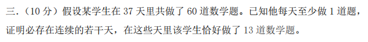
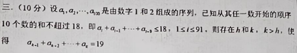
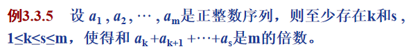

# 组合数学复习

[TOC]

## 第一章 排列与组合

### 1.1 基础概念

> 1. **基本计数原理**
>
> - 加法原理
>
>   A事件有m种产生方式，B事件有n种产生方式，故A，B事件之一有m+n种产生方式。
>
> - 乘法原理
>
>   A事件有m种产生方式，B事件有n种产生方式，故A与B事件有m*n种产生方式。
>
> - 一一对应原理
>
>   如果A事件与B事件间存在一一对应原则，则A与B一样大
>
> 2. **排列与组合**
>
> - 排列
>
>   从n个不同的元素中，取r个不重复的元素，按次序排列，称为从n中取r个多无重排列
>   $$
>   A_n^r=P_n^r=n(n-1)....(n-r+1)=\frac{n!}{(n-r)!}
>   $$
>
> - 组合
>
>   从n个不同的元素种，取r个不重复的元素，而不考虑其元素的顺序，称为从n个中取r个的无重组合
>   $$
>   C_n^r=P_n^r/r!=\frac{n!}{r!(n-r)!}
>   $$
>
> - 圆周排列
>
>   从n个不同的元素中，取r个不重复的元素，按次序排列在一个圆周上，称为从n个中取r个的无重圆周排列
>   $$
>   Q_n^r=P_n^r/r=\frac{n!}{(n-r)!\cdot r}
>   $$
>
> 3. **若干等式及其组合意义**
>
> - 组合意义与组合证明
>
> - 若干等式
>
>   1. $$
>      C_n^r=C_n^{n-r}
>      $$
>
>      从n个元素中去掉一个r子集，剩下一个n-r子集，由此建立了一个一一对应的关系
>
>   2. $$
>      C_n^r=C_{n-1}^r+C_{n-1}^{r-1}
>      $$
>
>      从[1,n]任取r个元素：a1,a2,…,ar. 设a∈ [1,n] 为任意一个固定元素，对取法分类：如果a∈{a1,a2,…,ar},  有C(n-1,r-1)种方案。如果a不属于{a1,a2,…,ar},  有C(n-1,r)种方案，故上述等式成立
>
>   3. $$
>      C_{m+r+1}^r=C_{m+r}^r+C_{m+r-1}^r+...+C_{m+1}^1+C_m^0
>      $$
>
>      从m+r+1个元素中任取r个元素：A={a1,a2,…,ar}. 设c1,c2,…,cr ∈ [1,m+r+1] 为任意r个固定元素，对取法分类：如果A不含c1，有C(m+r,r)种方案。  如果A含c1但不含c2，有C(m+r-1,r-1)种方案如果A含c1， c2但不含c3，有C(m+r-2,r-2)种方案 …，…，…如果A含c1，…，cr-1但不含cr，有C(m+1,1)种方案如果A含c1， …，cr-1，cr ，有C(m+0,0)=1种方案
>
>   4. $$
>      C_n^n+C_n^{n-1}+...+C_n^1+C_n^0=2^n
>      $$
>
>      右边对集合的每一子集来说，n个元素都有取或不取两种可能.所有选取方案有2n个.        左边子集可按包含元素多少分类为：含0个元素-子集(空集)，含1个元素-子集，…，含n个元素-子集
>
>   5. $$
>      C_n^0-C_n^1+...+(-1)^nC_n^n=0
>      $$
>
>      $C_n^r$ 代表的含义是从n个元素中取出r个元素来，但我们可以找到一个一一对应的关系，包含a的和不包含a的，同时我们可以加上a或者删去a，那么就会从r为奇数的情况变到r为偶数的情况，通过这样我们可以发现$\sum_{i为奇数} C_n^i=\sum_{j为偶数}C_n^j$
>      
>   6. $$
>      C_n^l\cdot C_l^r=C_n^r\cdot C_{n-r}^{l-r}
>      $$
>
>      等式左边表示从n名中央委员中选出l名政治局委员,再从l名政治局委员中选出r名常委的所有不同选法等式右边表示从n名中央委员中直接选出r名常委，再从n-r名中央委员中选出l-r名非常委的政治局委员的所有不同选法
>   
>   7. $$
>      C_{m+n}^r=\sum_{0\le k\le r}C_m^k C_{n}^{r-k}
>      $$
>   
>      等式左边表示从m个红球，n个蓝球中任意选出r个,所有不同选法等式右边表示按r个球的状态，可按含红蓝球（或蓝球）多少分类为：含0个红球，含1个红球，…，含r个红球，且含k个红球的 选法有：C(m,k) C(n, r-k)
>      
>   7. $$
>      \sum_{i=r}^nC_i^r=C_{n+1}^{r+1}
>      $$
>   
>      右边可以理解为从n+1个同学里选r+1个学生，左边是固定第一个同学然后从n个同学选r个学生，加上除去第一个同学再加上第二个同学然后从n-1个同学选r个学生，.....
>
> 4. **Stirling近似公式**
>
> 5. **排列与组合的生成算法**
>
> 6. **排列与组合的推广**
>
> - 圆周排列
>
>   从n个不同的元素中，取r个不重复的元素，按次序排列在一个圆周上，称为从n个中取r个的无重圆周排列
>   $$
>   Q_n^r=P_n^r/r=\frac{n!}{(n-r)!\cdot r}
>   $$
>
> - 允许重复组合与不相邻组合
>
>   从n个不同的元素中，可重复的取r个元素，作为一组，称为从n个中取r个的可重组合
>   $$
>   C_{n+r-1}^r
>   $$
>   所谓不相邻组合是指从A={1,2，…，n}中取r个不相邻的数的组合。
>   $$
>   C_{n-r+1}^r
>   $$
>
> - 不尽相异元素的组合
>   $$
>   C(n,n_1,n_2....n_k)=C_n^{n_1,n_2...n_k}=\frac{n!}{n_1!\cdot n_2!....n_k!}
>   $$
>
> - 有限制排列
>
>   将n2个数排成n行n列的一个数表用来表示一个数，其值等于所有可能取自不同行不同列的n个元素乘积的和，称为积和式
>
>   将问题转换为积和式的计算问题

### 1.2 整数除尽问题

问题抛出一个整数，我们将该整数化为几个质数的次方，然后所有能除尽该整数的个数，说白了就是选取多少个质数乘积的一个问题

Eg:
$$
n=7^3\times 11^2\times13^4
\\从而满足我们条件的整数为：7^{l_1}\times11^{l_2}\times13^{l_3},其中\begin{cases}0\le l_1\le3\\0\le l_2\le2\\0\le l_3 \le 4\end{cases}\\根据乘法法则，能除尽n的数的数目为4\times3\times5
$$

### 1.3 插空法的应用

这种方法的典型出现场景是在两类物品排列顺序中，例如我们在书本例题 1-14的男女运动员，或者是 0，1 排列，我们试图从这类问题形成一定的条件反射，从而想到整个问题的解决方案

Eg：男运动员有 7 名，女运动员有 3 名，列队进场，若要求头尾两名运动员是男性，而且女运动员不能相邻，问有多少种方案
$$
我们可以先将男运动员排列如下：
\\m_1 \circ m_2\circ m_3\circ m_4 \circ m_5 \circ m_6 \circ m_7
\\我们从上述的排列中选取空心圆中的 3 个作为我们填充女运动员，从而我们可以得到答案C_6^3\times 3!\times7!(因为有序)
$$

### 1.4 减去反例的计算方法

当我们遇到题目要求的计算的反例更容易计算时我们可以选择用整体的方案数，减去题目的反例的方案个数，从而得到最终答案

Eg:5 个女生 7 个男生要组成一个含 5 个人的小组，要求该小组不允许男生甲和女生乙同时参加，试问有多少种方案？
$$
12个人取 5 个人的组合为：C_{12}^5\\甲和乙同时参加的方案为C_{10}^3,故所求的方案数为二者相减
$$

### 1.5 不尽相异元素的组合

> $$
> 若在n个元素中，有n_1个元素彼此相同，n_2个元素彼此相同，....，则这n个元素中全出r个的选排列叫做\\不尽相异元素的选排列，其排列数计算工时为:\frac{A(n,r)}{n_1!\cdot n_2!\cdots n_m!}
> $$

### 1.6 圆周排列

> 从n个不同元素中，取r个不重复的元素，按次序排列在一个圆周上，称为从n个中取r个的无重圆周排列
> $$
> Q_n^r=\frac{P_n^r}{r}=\frac{n!}{(n-1)!r}
> $$

Eg:n对夫妻围一圆桌而坐，求每对夫妻相邻而坐的方案数
$$
N=(n-1)!\times2^n
$$

### 1.7 隔板法解决整数解个数问题

> $$
> 已知线性方程x_1+x_2+\cdots+x_n=b，n和b都是整数，n\ge1，求此方程的非负整数解的个数。
> $$
>
> 我们可以将该问题转换为b个 1，然后通过n-1个板将b个 1 分割为n个部分，但因为我们需要有n-1个板，所以我们对整个上加上n-1个 1，所以可以得到这类问题的解为$C_{b+n-1}^{n-1}$

应用：试问$(x+y+z)^4$有多少项

这个问题可以同义转换为$x^{l_1}y^{l_2}z^{l_3}$,其中$l_1+l_2+l_3=4$，其中所有整数解的可能，也就与我们上面描述的问题相对应上了

### 1.8 对若干等式的证明

[我们在基础概念中已经对其部分证明进行了解释](#1.1 基础概念)

（书 P109,例 2-61）**n个 1 和n个 0 组成一个2n位 d 二进制数，要求从左到右扫描，1 的累计数不小于 0 的累计数，试求满足这个条件的数有多少？**

令An为n个“1”和n个“0”组成的符合二进制数的个数，n个“1”和n个“0”组成的二进制数可以看作是一种类型（1型）为n个元素和另一种类型（0型）的n个元素的两种不同元素的排列，这样的排列个数位C(2n,n) = (2n)!/(n!n!)，从C(2n,n)中减去不符合要求的个数即为所求的An，考虑n个"1"和n个"0"组成的不符合要求的二进制数，不符合要求的数应为：从左到右扫描时，必然存在一个最小的k使得在这k位上首先出现"0"的累计数多于"1"的累计数，特别得，k是一个奇数，而在k之前的k-1位数中，有相等个数的"0"和"1"，而且这第k位上是"0"，现在把这前k位中每一位上的数进行交换，"1"换成"0"，"0"换成"1"，并且保持剩下的数不变，结果这样的二进制数是一个有n+1个"1"和n-1个"0"的二进制数，即一个不合要求的二进制数对应一个由n+1个"1"和n-1个"0"组成的一个排列，这个过程是可逆的：任何一个由n+1个"1"和n-1个"0"组成的2n位数，由于"1"的个数比"0"的个数多2个，2n是偶数，因此必在某个奇位数上出现"1"的累计数超过"0"的累计数，同样对他们进行交换，并使其余的不动，使之成为由n个"1"和n个"0"组成的2n位数，这时"0"的累计个数多于"1"的累计个数，是一个不符合要求的二进制数，从而不符合要求的二进制数与n+1个"1"和n-1"0"组成的排列一一对应，这样的排列个数为C(2n,n+1) = (2n)!/((n+1)!(n-1)!) 因此有An = C(2n,n)-C(2n,n+1)

## 第二章 递推关系和母函数

**常用的幂级数展开式**
$$
\frac{1}{1-x}=\sum_{n=0}^\infty x^n\\
e^x=\sum_{n=0}^\infty \frac{x^n}{n!}
\\(1+x)^a=\sum_{n=0}^\infty \frac{a(a-1)\cdots (a-n+1)}{n!}x^n
$$

### 2.1 线性常系数齐次递推关系

**我们只对特征跟方程的方法进行详细学习，因为较为简便**

> - **线性常系数递推关系**
>   $$
>   形如a_n+c_1a_{n-1}+c_2a_{n-2}+...+c_ka_{n-k}=b_n,(n>k-1),\\当b_n=0时，上式成为k阶线性常系数齐次递推关系，\\当b_n\ne0时，上式成为k阶线性常系数非齐次递推关系。
>   $$
>
> - **线性常系数递推关系的母函数方法(计算过于复杂，不进行详细讨论)**
>
>   1. 观察题目有几项a,写出 A(x)的式子，除了几项a其余用n表示
>   2. 将递推关系代入母函数
>   3. 化简并求解A(x)
>   4. 使用一些已知的幂级数展开式来展开 A(x)
>
> - **线性常系数齐次递推关系的特征跟方法**
>   $$
>   k阶常系数齐次递推关系：a_n+c_1a_{n-1}+c_2a_{n-2}+\cdots+c_ka_{n-k}=0
>   \\特征多项式：C(x)=x^k+c_1x^{k-1}+\cdots+c_k
>   \\特征方程：C(x)=0
>   \\特征跟：特征方程的根称为特征跟
>   $$
>
>   1. 特征多项式无重根：
>
>   $$
>   a_n=\sum_{i=1}^kA_ia_i^n
>   $$
>
>   2. 特征多项式有共轭复根：
>
>   $$
>   a_1=\rho(\cos\theta+i\sin\theta)\ \ \ a_2=\rho(\cos\theta-i\sin\theta)
>   \\a_n=A\rho^n\cos n\theta+B\rho^n\sin n\theta
>   $$
>
>   3. 特征多项式有重根：
>
>   $$
>   a_n=(B_n+B_1n+\cdots+B_{k-1}n^{k-1})a^n
>   $$
>
> - **线性常系数非齐次递推关系的齐次化方法**
>
>   该方法是指通过调整递推关系的下标，整理出一个新的式子可以与原式子进行合并从而消除掉等式右侧，从而将非齐次递推关系变为齐次递推关系。
>
>   一次不行可以弄两次
>
> - **线性常系数非齐次递推关系的待定系数法**
>
>   可以表示为齐次关系的解与非齐次关系的解之和
>   $$
>   b_n=r^np_m(n)的特解设为：\beta_n^*=r^nn^kq_m(n)
>   \\其中，k为r作为特征跟的个数。
>   $$
>
>   $$
>   b_n=r^np_m(n)\sin\theta或r^np_m(n)\cos\theta
>   \\特解设为：\beta_n^*=r^nn^k[q_m(n)\sin n\theta+h_m(n)\cos n\theta]
>   \\其中，k为r(\cos\theta+i\sin\theta)作为特征跟的个数
>   $$
>

**例题：**
$$
求解非齐次递推关系:\begin{cases}
a_n-3a_{n-1}-4a_{n-2}=10(-1)^n,n\ge2
\\a_0=1,a_1=2,
\end{cases}
\\解：根据题意可以得到特征方程r^2-3r-4=0,解得：r_1=4,r_2=-1,
\\由于b_n=10(-1)^n,所以，设特解为a_n=An(-1)^n，代入到递推关系中：
\\An(-1)^n-3A(n-1)(-1)^{n-1}-4A(n-2)(-1)^{n-2}=10(-1)^n,解得A=2
\\故通解为a_n=c_14^n+c_2(-1)^n+2n(-1)^n
\\由初始条件a_0=1,a_1=2,解得c_1=1,c_2=0
\\故我们所需要的解为a_n=4^n+2n(-1)^n
$$

### 2.2 整数的拆分问题

> 有 1 克、2 克、3 克、4 克的砝码各一枚，问能称出多少重量，并各有几种称法

这问题可以看成将n拆分成 1,2,3,4 之和且不允许重复的拆分数，利用母函数计算如下：
$$
(1+x)(1+x^2)(1+x^3)(1+x^4)
\\=(1+x+x^2+x^3)(1+x^3+x^4+x^7)
\\=1+x+x^2+2x^3+2x^4+2x^5+2x^6+2x^7+x^8+x^9+x^{10}
$$

### 2.3 指数型母函数

> $$
> 对于序列a_0,a_1,a_2,\cdots定义G_e(x)=a_0+\frac{a_1}{1!}x+\frac{a_2}{2!}+\cdots为序列\{a_i\}的指数型母函数
> $$

$$
(1)序列\{1,1,\cdots\}的指数型母函数，e^x\\
(2)序列\{0!,1!,\cdots\}的指数型母函数,\frac{1}{1-x}
$$

> Eg:
>
> 将 1,3,5,7,9 这 5 个数字组成n位数，要求 3 和 7 出现的次数为偶数，其他 3 个无限制，问这样的数的个数等于多少？
> $$
> G_e(x)=(1+\frac{x^2}{2!}+\frac{x^4}{4!}+\cdots)(1+x+\frac{1}{2!}x^2+\cdots)
> \\=(\frac{e^x+e^{-x}}{2})^2\times e^{3x}
> =\frac{1}{4}(e^{2x}+2+e^{-2x})\cdot e^{3x}=\frac{1}{4}(e^{5x}+2e^{3x}+e^x)
> \\=\frac{1}{4}\sum_{n=0}^\infty(5^n+2\cdot 3^n+1)\frac{x^n}{n!}
> \\a_n=(5^n+2\cdot 3^n+1)/4
> $$

### 2.4 母函数和递推关系应用举例

> n条直线将平面分成多少个域？假定无三线巩店，且两两相交

在对这个问题时我们可以发现，第n条直线与前n-1条直线都相交，从而第n条直线被分成了n段，每一段都将原来的一个区域分为两个所以可以发现该问题的递推关系式为：
$$
\begin{cases}
a_n=a_{n-1}+n\\
a_1=2
\end{cases}
$$

$$
我们将a_n进行展开，a_n=a_{n-1}+n,
\\a_{n-1}=a_{n-2}+n-1
\\\cdots
\\a_1=a_0+1
\\所以可以得到a_n=a_0+1+\cdots+n=1+\frac{n(n+1)}{2}
$$

> 设有n条椭圆曲线，两两相交于两点，任意 3 条椭圆曲线不相交于一点，试问这样的n个椭圆将平面隔成多少个部分

记住吧，后边有时间再去研究2+n(n-1)

### 2.5 第二类斯特林数字

> n个有区别的球放到m个相同的盒子中，要求无一空盒，其不同的方案数用S(n,m)表示，称为第二类斯特林数

$$
s_2(n,2)=2^{n-1}-1，两个盒子无区别，当第 1 个球放进其中一个盒子后，\\其余n-1个有标志的球都有与第 1 个球同盒与否的两种选择，共有2^{n-1}种，然后减去一种一个盒为空的可能
\\s_2(n,n-1)=C_n^2,取出两个放入一个盒子，其余每个盒子都只有一个球
$$

**递推关系为$S(n,m)=mS(n-1,m)+S(n-1,m-1)$**

1. **$S(n-1,m-1)$**

   对于这部分我们先假设第一个球单独放入到第一个盒中，通过这样将其余n-1个球放入到其余m-1个盒中

2. **$mS(n-1,m)$**

   对于这部分我们相将n-1个球放入到m个盒子中，再将第一个球放入到其中随机一个盒子中

### 2.6 Catalan数

$$
C_{n+1}=\sum_{k=2}^nC_kC_{n-k+2}
\\(n-3)C_n=\frac{n}{2}\sum_{k=3}^{n-1}C_kC_{n-k+2}
\\C_2=1,C_3=1
$$

### 2.7 排列组合之 N 球放 M 盒问题

| 具体情况                     | 方法                                |
| ---------------------------- | ----------------------------------- |
| 球同，盒同，盒不可以为空     | 穷举法                              |
| 球同，盒同，盒可以为空       | 穷举法                              |
| 球同，盒不同，盒不可以为空   | 插板法$C_{N-1}^{M-1}$               |
| 球同，盒不同，盒可以为空     | 插板法$C_{N+M-1}^{M-1}$             |
| 球不同，盒同，盒不可以为空   | $S(N,M)$                            |
| 球不同，盒同，盒可以为空     | $S(N,1)+S(N,2)+S(N,3)\cdots+S(N,M)$ |
| 球不同，盒不同，盒不可以为空 | $M!\cdot S(N,M)$                    |
| 球不同，盒不同，盒可以为空   | $M^N$                               |

### 2.8 递推关系式解决错拍问题

1. **首先我们先试着写出它的递推关系式**

   - 考虑第一封信把它放入到其余的n-1个信箱中，有n-1种方法
   - 考虑第二封信，这时有两种情况
     1. 第二封信放入到第一个信箱中，这时我们可以对剩余的n-2个信进行全错排
     2. 第二封信不放入到第一个信箱，这时我们可以对带上第二封信的n-1封信进行全错拍，第二封信对应第一个信箱（因为这种情况下第二封信不能放入到第一个信箱中）

   我们可以得出它的递推关系式
   $$
   D_n=(n-1)(D_{n-1}+D_{n-2})
   $$
   然后我们在运用一个变形
   $$
   D_n-nD_{n-1}=(n-1)(D_{n-1}+D_{n-2})-nD_{n-1}
   \\=-[D_{n-1}-(n-1)D_{n-2}]
   \\=(-1)^2[D_{n-2}-(n-2)D_{n-3}]
   \\=\cdots
   \\=(-1)^{n-2}(D_2-2D_1)
   =(-1)^n
   \\同理我们可以得出：D_n=nD_{n-1}+(-1)^n
   $$
   我们对上面式子的左右同时除以n!

   可以得到最后的式子
   $$
   \frac{D_n}{n!}=\sum_{i=0}^n\frac{(-1)^i}{i!}
   $$

2. **对于部分错拍问题**

   我们考虑对其部分元素放到正确位置上，其余错拍就行，也就是前面乘了个 C

## 第三章 容斥原理与鸽巢原理

### 3.1 容斥原理的使用

> $$
> 设有与性质 1,2，\cdots,n相关的元素N 个，A_i为具有第i种性质的元素的集合(i=1,2,\cdots,n),\\a_k为至少有k种性质的元素的元次，\beta_k为恰有k种性质的元素的个数
> \\a_0=N,a_1=\sum_{i=1}^n|A_i|,a_2=\sum_{i_1\neq i_2}|A_{i_1}\cap A_{i_2}|
> \\a_k=\sum_{i_1,i_2,\cdots,i_k}|A_{i_1}\cap A_{i_2}\cdots A_{i_k}|
> \\则\beta_k=a_k-C_{k+1}^ka_{k+1}+\cdots+(-1)^iC_{k+i}^ka_{k+i}+\cdots+(-1)^{n-k}C_n^ka_n
> $$

1. **求整数解的个数**

   
   $$
   由题意可知满足x_1+x_2+x_3=15的解的个数有：
   \\假设总共有 15+3-1 个位置，取出其中两个用于放隔板其余位置放 1，隔出来的三个数正好是x_1,x_2,x_3
   \\N=C_{15+3-1}^2=136
   \\同理可求得下面内容：
   \\A_1为具备 x_1\ge6条件，设y_1=x_1-6,y_2=x_2,y_3=x_3,|A_1|=C_{9+3-1}^2=55
   \\A_2为具备x_2 \ge7条件，设y_1=x_1,y_2=x_2-7,y_3=x_3,|A_2|=45
   \\A_3为具备x_3\ge8条件，设y_1=x_1,y_2=x_2,y_3=x_3-8,|A_3|=36
   \\|A_1\cap A_2|=6,|A_1\cap A_3|=3,|A_2\cap A_3|=1
   \\|A_1\cap A_2\cap A_3|=0
   \\故：|\overline{A_1}\cap\overline{A_2}\cap\overline{A_3}|=N-\sum|A_i|+\sum|A_i\cap A_j|-|A_i\cap A_j\cap A_k|
   \\=136-136+(6+3+1)-0
   \\=10
   $$
   **对于部分问题可能开始的x并没有大于等于0，但我们可以通过变换等式，将变量变成我们所需要的模样**

2. **夫妻对坐问题**

   > n对夫妻围圆桌而坐，求夫妻不相邻的方案数

   $$
   设A_i=第i对夫妻相邻而坐的集合，i=1,2,\cdots,n,
   \\所以我们需要的答案是|\overline{A_1}\cap\overline{A_2}\cap\overline{A_3}\cdots\overline{A_n}|=\\N-\sum_{i=1}^n|A_i|+\sum_{i=1}^n\sum_{j\ge i}|\overline{A_i}\cap\overline{A_j}|-\cdots+(-1)^n|\overline{A_1}\cap\overline{A_2}\cdots\cap\overline{A_n}|
   $$

   | name                          | value        |
   | ----------------------------- | ------------ |
   | $N$                           | $(2n-1)!$    |
   | $|A_i|$                       | $2(2n-2)!$   |
   | $|A_i\cap A_j|$               | $2^2(2n-3)!$ |
   | $\cdots$                      | $\cdots$     |
   | $|A_1\cap A_2\cdots\cap A_n|$ | $2^n(n-1)!$  |

3. **容斥原理解决错排问题**

   | name                          | value    |
   | ----------------------------- | -------- |
   | $N$                           | $n!$     |
   | $|A_i|$                       | $(n-1)!$ |
   | $|A_i\cap A_j|$               | $(n-2)!$ |
   | $\cdots$                      | $\cdots$ |
   | $|A_1\cap A_2\cdots\cap A_n|$ | $1$      |

4. **求由a,b,c,d这4个字符构成n位符号串，其中a,b,c至少出现一次的数目**（答案：$4^n-3\cdot 3^n+3\cdot2^n-1$）
5. **求不超过120的素数个数**（答案：27）

### 3.2 鸽巢原理

> 我们将该问题的主要解决方案视为几个重点
>
> 1. 前缀和序列的使用
> 2. 奇偶性质的观察
> 3. 取余的便捷技巧

1. **$设a_1,a_2,\cdots,a_{100}是由1和2组成的序列，已知从其中任意一个数开始的顺序中10个数的和不超过16，\\即对于1\le i\le91，恒有a_h+a_{h+1}+\cdots+a_k\le16,则至少存在h和k,k>h,使得a_h+a_{h+1}+\cdots+a_k=39$**

   > 解决该类问题的主要思路：
   >
   > 1. 构造序列$s_1,\cdots,s_n$其中$s_n=a_1+\cdots+a_n$
   > 2. 根据题意想要知道的k(例如该题的k为39)，构造序列$s_1,\cdots,s_n,s_1+k,\cdots,s_n+k$
   > 3. 得到$s_n+k\le n*w/10+k$
   > 4. 根据鸽巢定理可以得到有两项一样，所以存在差为k的两项，问题得到证明

   **题目变形**

   

   

2. **$从1到2n的2n个正整数中任取n+1个，则这n+1个数中至少有一对数，其中一个数是另一个数的倍数$**

   

   > 主要思路：
   >
   > 解决带有倍数关键字问题的关键是取余，例如对于上述题目，我们可能会遗漏掉一个信息就是2n个数字中只有n个数字为奇数，所以对n+1个数字除去一切 2 的因子可以得到n+1个奇数，一定有两个一样，而这两个数字的未取余前的数字一定存在2的倍数关系
   >
   > 同理，对于教材中的3-26，我们可以使用前缀和的思想和取余思想的结合，像该小节1中的思路，先构造前缀和序列，对其进行分类讨论，如果前缀和为m的倍数则直接证明，若不为则对其进行取余

## 第四章 群

### 4.1 Polya定理

> **Polya定理：**
> $$
> 设N=\{1,2,\cdots,n\}是被染色物体的集合，G=\{\sigma_1,\sigma_2,\cdots,\sigma_g\}是N上的置换群。用m种颜色对N中\\的元素进行着色，则在G的作用下不同的着色方案数是：M=\frac{1}{|G|}\sum_{k=1}^gm^{c(\sigma_k)}\\其中，c(\sigma_k)是置换\sigma_k的轮换表达式中的轮换个数
> $$

1. **长为6的透明的方格，用红、蓝、黄、绿4种颜色进行染色，试问有多少种不同的方案？**

   > 对于这类问题
   >
   > 1. 我们都是要先写出置换群G，而置换群G是怎么来的呢？就是我们对初始情况的等价情况的一种汇总，例如我们对于当前问题从左向右的看，和从右向左看的结果是一致的，因为我们把6个方块旋转一百八十度不就是另外一种情况吗？所以，我们可以得到两种置换，对于第一种就是我们一开始的情况1位置对应1，2对于2，....，从而第二种置换我们也可以得知位置1对应6，2对应5，所以我们得出了两种置换，同理对于这个问题也只有两种置换。
   > 2. 写出了置换群，接下来我们需要知道每种置换中的一个轮换个数，什么叫做轮换呢，例如(1,2,3),其中1对应2,2对应3,3对应1，我们可以知道每一个置换由几个轮换组成，例如$\begin{pmatrix}1&2&3&4&5&6\\6&5&4&3&2&1\end{pmatrix}$通过观察我们可以发现(1,6)(2,5)(3,4)是三个轮换
   > 3. 我们要保证每个轮换内的颜色是一样的，所以对于我们上面的那个置换，它的可能方案数是$4^3$因为有四种颜色可以选择
   > 4. 我们将每种置换的方案数加起来（例如这道题目为$4^6+4^3$,因为初始条件的置换有6个轮换），再除以置换群的置换个数（例如这道题是2），最后可以得出我们的不同方案个数（例如这道题答案为$\frac{1}{2}(4^6+4^3)$）

2. **用3个红珠子和2个蓝珠子镶嵌在圆环上，试问有多少种不同的方案**

   因为这是一个圆环，所以我们在写置换群的时候，需要考虑一个是圆环转动的情况，一个是延某个轴旋转的情况

   - 圆环转动：(1,2,3,4,5),(1,3,5,2,4),(1,4,2,5,3),(1,5,4,3,2)
   - 圆环旋转：(1)(2 5)(3 4)这是以1点和圆上对称点为中心轴进行旋转的结果，同理可以考虑以2,3,4,5为中心轴旋转的结果

   但这个问题在染色时候，需要我们去单独考虑每种置换，因为它的染色比较特殊，单通过轮换个数并不能得出我们想要的一个答案，然后去看书吧，懒得写了（P188 例4-9）

3. **甲烷$CH_4$的4个键任意用H,Cl,$CH_3$, $C_2H_5$ 连接，有多少种方案？**

   首先，你得知道甲烷是个正四面体，哈哈哈哈哈哈

   然后我们考虑它的置换群，一类是绕过顶点及它在对面的面中心的点的直线旋转120º，240º。另一是绕V1V2与V3V4中点连线旋转180º

   

4. **正六面体的6个面分别用红、蓝两种颜色着色，问有多少种不同方案？**

   **用两种颜色给正六面体的8个顶点着色，试问有多少种不同的方案？**

   这两个问题的相似点在于都是在正方体上面进行操作的，所以我们可以得到相同的旋转规律

   - 沿对面中心轴旋转90,180,270，正方体有3个对面，所以总共有9种置换（注意180要分开单独考虑）
   - 沿对边中点轴旋转180，共有6种置换
   - 沿对角线轴旋转120,240，共有4条对角线，也就是8种置换

   前两种较好理解，在想第三种的时候，我们可以尝试将正方体一切为二，先只考虑对角线中的一个角，然后旋转，就可以想到它们之间的变换关系

### 4.2 母函数形式的Polya定理

> 因为对于Polya的每个轮换中，需要保证他们的颜色一致，所以对于$(v_1)(v_2)(v_3)(v_4)$它母函数形式就是$(b+g+r)^4$因为每个点都可能取到所有的b,g,r，但对于例如$(v_1)(v_2)(v_3v_4)$我们针对$(v_3v_4)$的母函数形式就是$(b^2+g^2+r^2)$因为它两个元素的颜色要一致

1. **将4颗红色的珠子嵌在正六面体的4个角，试求多少种方案**

这个问题等同于对正方体顶点进行染色，只有两种颜色一种不染，一种红色，也就是求出b^4^r^4^的系数

### 4.3 部分常用方案

- **正方体的六个面**

| Name               | Num  |
| ------------------ | ---- |
| (1)(2)(3)(4)(5)(6) | 1    |
| (1)(2345)(6)       | 6    |
| (1)(24)(35)(6)     | 3    |
| (16)(25)(34)       | 6    |
| (345)(152)         | 8    |

- **正方体的八个顶点**

| Name                     | Num  |
| ------------------------ | ---- |
| (1)(2)(3)(4)(5)(6)(7)(8) | 1    |
| (1234)(5678)             | 6    |
| (13)(24)(57)(68)         | 3    |
| (17)(26)(35)(48)         | 6    |
| (2)(136)(8)(475)         | 8    |

## 结束语

> **Open source is a spirit that arises for freedom and equality.**
>
> *如发现内容错误，请联系编辑者进行修正，该内容仅针对2023级的重点，但每年的核心应为固定的*
>
> E-mail:2303112308@qq.com
>
> File Source Address:https://wr0519.github.io/moan-blog/#/

