# 机器学习复习笔记

[TOC]

##  绪论

- **机器学习是什么**

  - **机器学习与深度学习、神经网络的关系**

    传统神经网络是实现机器学习中分类、聚类、回归等模型的重要方法。后来人们发现改进的神经网络可以自动提取特征，从而发展为深度学习的分支

    

- **发展历程**

- **机器学习算法**

  - **监督学习、无监督学习、半监督学习**

    根据是否有标签的训练数据来学习一个模型

  - **聚类模型、分类模型、回归模型和标注模型**

    聚类模型用于将训练数据按照某种关系划分为多个族

    分类模型用于将事物判定为预先设定的多个类别中的某一个

    回归模型的标签值不在是离散的值了而是连续的

    标注模型用于处理前后有关联的序列问题，输入一个观测序列，输出一个标签序列

  - **数据集统计**

    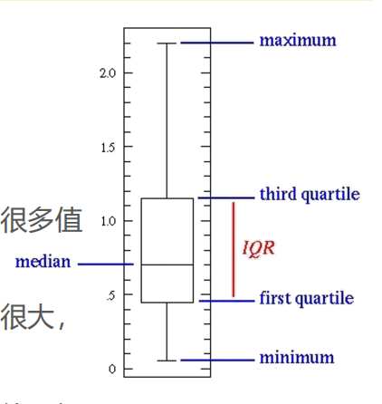

  - **泛化能力**

    机器学习适用于新样本的能力称为泛化能力

  - **归纳偏好**

    奥卡姆剃刀是一种常用的，选最简单的那个

    没有免费午餐定理，脱离具体问题，空谈算法无意义

- **学习之路**

  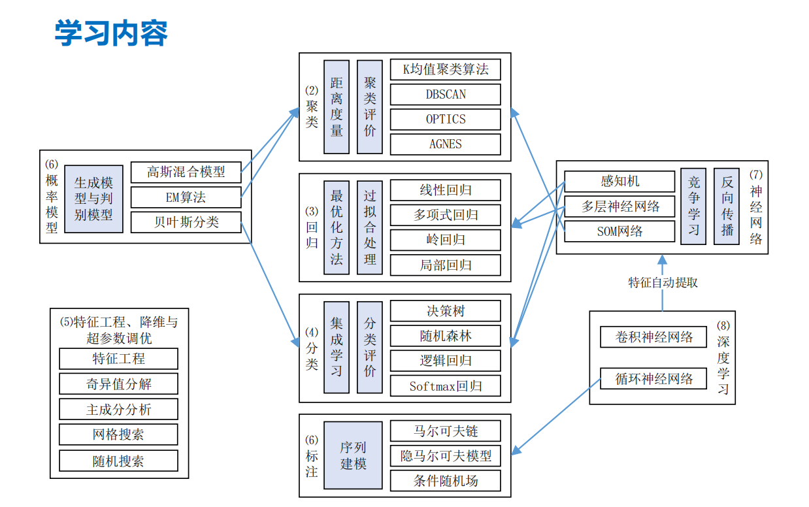

## 模型评估与选择

### 经验误差与过拟合

- **错误率和误差**

  错误率：错分样本的占比

  误差：训练误差：训练集上，测试误差：测试集，泛化误差：除训练集的所有样本

  目标：选取泛化误差最小的学习器，但实际只能使经验误差最小

- **过拟合和欠拟合**

  把训练样本学的“太好了”和对训练样本的一般性质都没学好

### 模型选择

- **评估方法**

  - 留出法

    直接将数据集划分为两个互斥集合

  - 交叉验证法

    将数据集分层采样划分为k个大小相似的互斥子集，每次用k-1个子集的并集作为训练集，余下的子集作为测试集，最终返回k个测试结果的均值

  - 自助法

    以自助采样法为基础，对数据集 D 有放回采样m次得到训练集D'，D/D'用做测试集

- **性能度量**

  - 回归任务中最常用的性能度量是“均方误差”

  - 错误率：分错样本占总样本的比例

  - 精度：分对样本占总样本的比例

  - 查准率P、查全率R、F1

    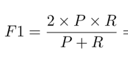

  - P-R曲线

    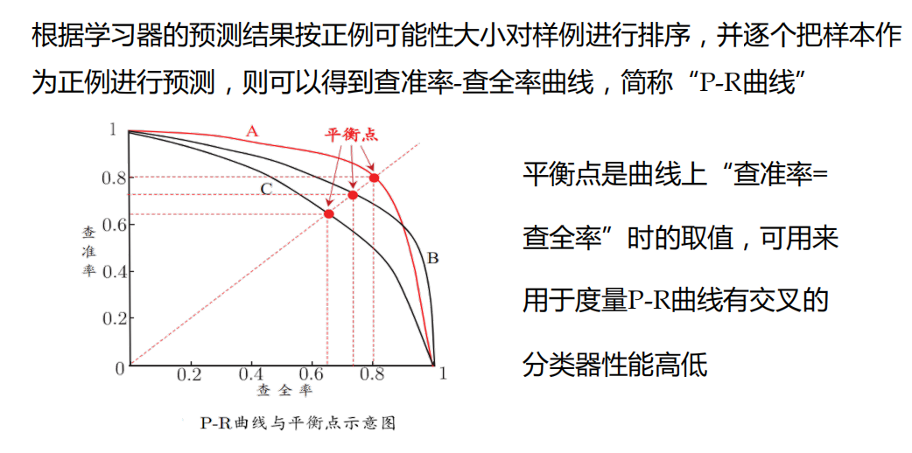

  - ROC曲线

    横轴：假正率          纵轴：真正例率

  - AUC

    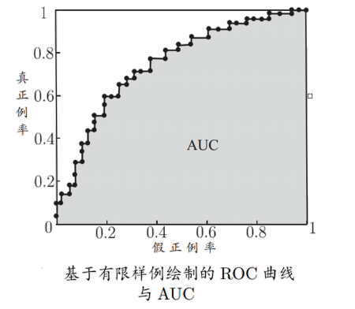

    *The bigger,the better*

- **比较检验**

  - 两学习器比较

    交叉验证t检验

    McNemar检验

  - 多学习器比较

    - Friedman检验
    - Nemenyi后续检验

- 偏差与方差

  - 通过实验可以估计学习算法的泛化性能

  $$
  E(f;D)=E_D[(f(x;D)-y_D)^2]\\
  =E_D[(f(x;D)-\overline f(x))^2]+(\overline f(x)-y)^2+E_D[(y-y_D)^2]\\
  =bias^2(x)+var(x)+\varepsilon^2
  $$

  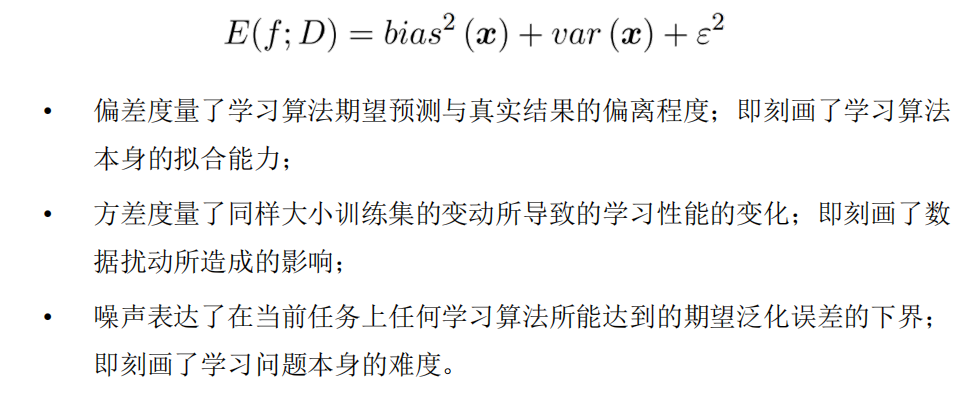

  - Bias-variance dilemma

    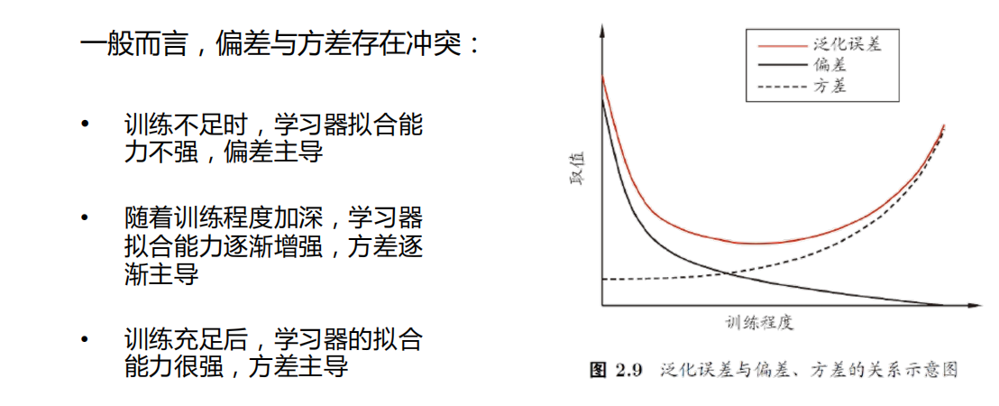

### 主要考察知识点

> 根据往年考察题目的观察，主要考察性能度量的相关计算，根据语意进行计算

**查全率**: 真实正例被预测为正例的比例 

**真正例率**: 真实正例被预测为正例的比例 

显然查全率与真正例率是相等的。 

**查准率**:预测为正例的实例中真实正例的比例 

**假正例率**: 真实反例被预测为正例的比例 

- 如何绘制 ROC 曲线
  - 根据学习器的预测结果进行排序
  - 对所有结果进行遍历，如果为正例则对 Y 轴加 1/m，如果为负例则对 X 轴加1/n，(m为正例个数，n为负例个数)
  - 连起来所有的点

## 聚类

### 聚类算法任务

*聚类算法在“无监督学习”任务中研究最多，应用最广，将样本划分为若干个不相交的子集，可以作为一个单独的过程，同样可以作为学习任务的前驱过程*

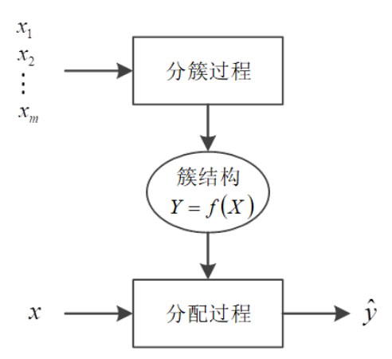

### 性能度量及距离计算

- **聚类性能度量**

  - 外部指标

    将聚类模型与参考模型进行比较

  - 内部指标

    直接考察聚类结果而不用任何参考模型

- **距离计算**

  - $$
    聚类得到的划分为C=\{C_1,C_2,...,C_k\},参考模型给出的簇划分为C^*,\\令\lambda与\lambda ^*分别表示C与C^*的簇标记向量\\
    a=|SS|=\{(x_i,x_j)|\lambda_i=\lambda_j,\lambda_i^*=\lambda_j^*,i<j\}\\
    b=|SD|=\{(x_i,x_j)|\lambda_i=\lambda_j,\lambda_i^*\neq\lambda_j^*,i<j\}\\
    c=|DS|=\{(x_i,x_j)|\lambda_i\neq\lambda_j,\lambda_i^*=\lambda_j^*,i<j\}\\
    a=|SS|=\{(x_i,x_j)|\lambda_i\neq\lambda_j,\lambda_i^*\neq\lambda_j^*,i<j\}\\
    $$

    **Jaccard系数（0，1 区间内越大越好）**
    $$
    JC=\frac{a}{a+b+c}([0,1]区间内，越大越好)
    $$
    **FM指数（0，1 区间内越大越好）**
    $$
    FMI=\sqrt{\frac{a}{a+b}\cdot\frac{a}{a+c}}([0,1]区间内，越大越好)
    $$
    **Rand指数（0，1 区间内越大越好）**
    $$
    RI=\frac{2(a+d)}{m(m-1)}([0,1]区间内，越大越好)
    $$
    **DB指数（越小越好 ）**
    
    **Dunn指数（越大越好）**
    
  - **各类距离**
    $$
    簇内样本平均距离：avg(C)=\frac{2}{|C|(|C|-1)}\sum_{1\le i\le j\le |C|}dist(x_i,x_j)\\
    簇内样本最远聚类：diam(C)=\max_{1\le i\le j\le |C|}dist(x_i,x_j)\\
    簇间最近距离：d_{min}(C)=\min_{x_i\in C_i,x_j\in C_j}dist(x_i,x_j)\\
    簇间中心点距离：d_{cen}(C)=dist(\mu_i,\mu_j)
    $$
    
  - **轮廓系数**（SC）
    
    SC值高表示自身簇聚类匹配较好，与其他簇匹配较差，即簇内密集，簇间疏散。
    
  - **常用距离**
    
    闵可夫斯基距离：
    $$
    dist(x_i,x_j)=(\sum_{u=1}^n|x_{iu}-x_{ju}|^p)^{\frac{1}{p}}
    $$
    p=2:欧式距离
    
    p=1:曼哈顿距离
    
  - **VDM处理无序属性**，例如{1,2,3}这样的为有序属性，{飞机，火车，轮船}这样的为无序属性
    
  - **MinkovDMp处理混合属性**
    
  - **余弦相似度**
    $$
    \cos\theta=\frac{x_i\cdot x_j}{||x_i||\cdot||x_j||}\\
    =\frac{\sum_{l=1}^nx_i^{(l)}x_j^{(l)}}{\sqrt{\sum_{l=1}^n(x_i^{(l)})^2}\cdot\sqrt{\sum_{l=1}^n(x_j^{(l)})^2}}
    $$

### 常见聚类方法

#### 原型聚类

通常情况下，算法先对原型进行初始化，再对原型进行迭代更新求解

- **K均值聚类**

  *K均值聚类算法的基本思想是让簇内的样本点更“紧密”一些，也就是说，让每个样本点到本簇中心的距离更近一些。使每个样本点到本簇中心的距离的平方和尽量小就是k-means算法的优化目标。每个样本点到本簇中心的距离的平方和也称为误差平方和（SSE），在优化算法中称为损失函数或代价函数。*

  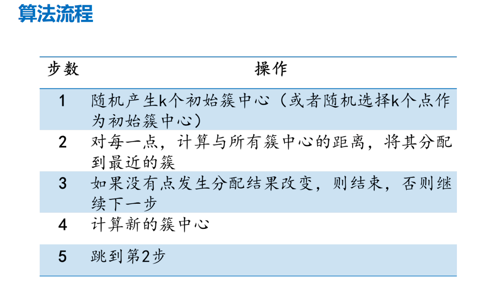

  

- **学习向量量化(LVQ)**

  *与一般聚类算法不同的是，LVQ假设数据样本带有类别标记，学习过程中利用样本的这些监督信息来辅助聚类.给定样本集 ，LVQ的目标是学得一组n维原型向量 ，每个原型向量代表一个聚类簇。*

  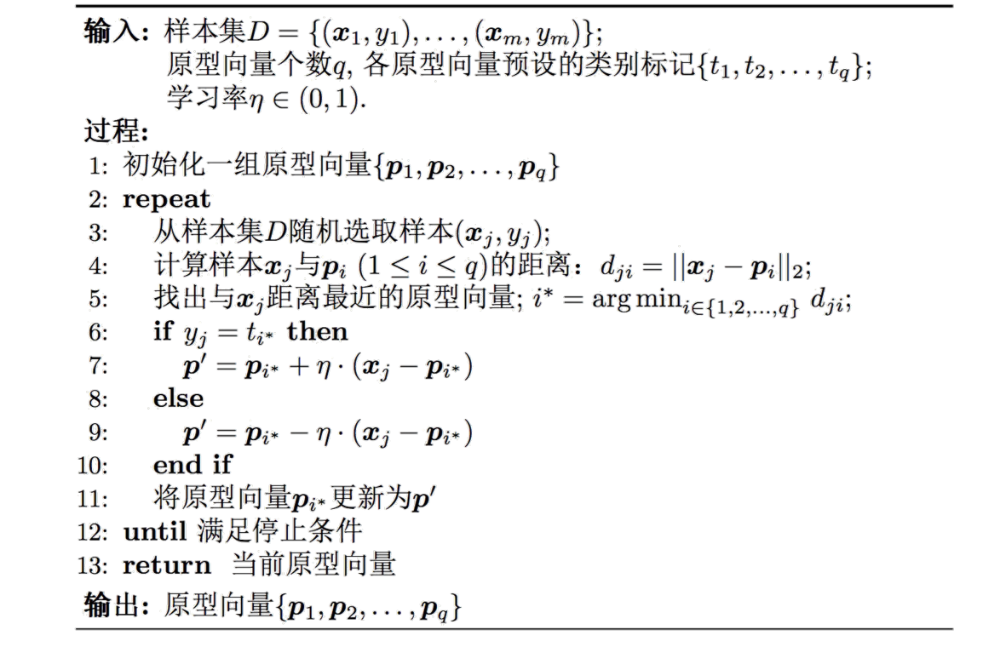

- **高斯混合聚类**

  高斯混合聚类采用概率模型来表达聚类原型

  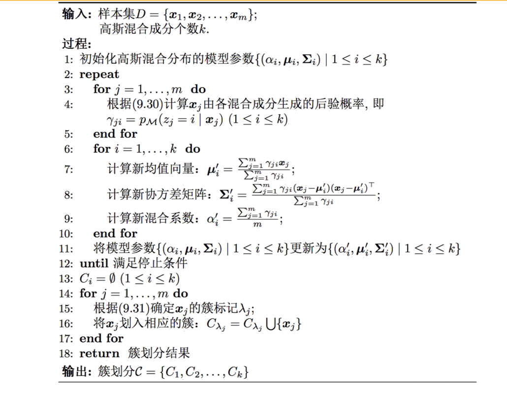

- **进一步讨论**

  - 簇中心的确定

    求总SSE，可以按簇计算SSE，然后求和。

    要使总SSE最小，只需要每簇SSE最小，因此，计算簇中心就是要求使得簇内SSE最小的那个点。

  - 算法复杂度

    设样本总数为m，分簇数为k。一次迭代过程中，以样本与簇中心点距离计算为基本运算，需要mxk次。如果迭代次数为t次，则算法的时间复杂度是O(mkt)

  - 局部最优与全局最优

    如果初始点选不好，就会陷入局部最优解，而无法得到全局最优解，这是因为SSE是所谓的非凸函数

  - K值的确定

    根据SSE值来确定，在大于一定分簇数时，SSE值趋于相对稳定。

  - 特征归一化
    $$
    Standard(x_i^{(j)})=\frac{x_i^{(j)}-\min x^{(j)}}{\max x^{(j)}-\min x^{(j)}}
    $$

- **改进算法**

  - 二分k-means算法

    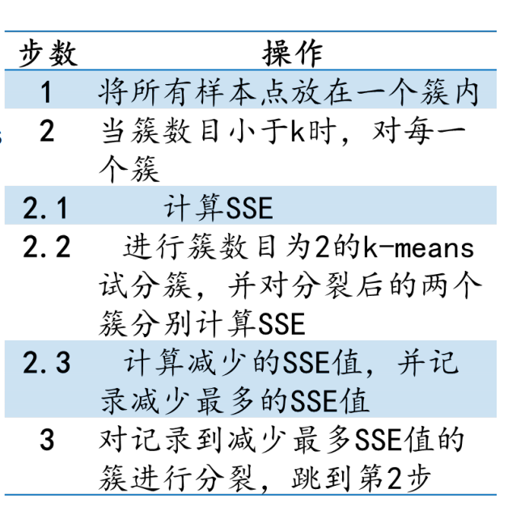

  - k-means++算法

    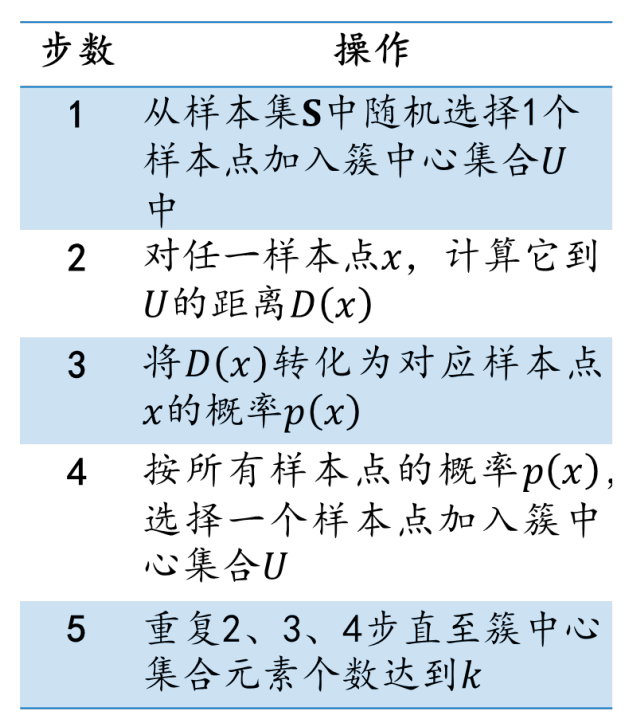

#### 密度聚类

*密度聚类是通过密度进行分簇，这里的密度是指某样本点给定领域内其它样本点的数量。*

- **密度相关的概念和定义**

  - $$
    \epsilon-邻域\\
    N_\in(x_i)=\{x_j|dist(x_j,x_i)\le\epsilon\}
    $$

  - 核心点和边界点

    核心点是领域中样本点数量不少于Minpts的点，相反的称为边界点

  - 直接密度可达
    $$
    若x_i位于x_j的领域内，且x_i是核心点，则称x_j可由x_i直接密度可达
    $$

  - 密度可达

    密度可达是由直接密度可达多次传递得到。

  - 密度相连

    对于点x和y，若存在点O，使得两点均可由O密度可达，则称两点密度相连

- **DBSCAN算法**

  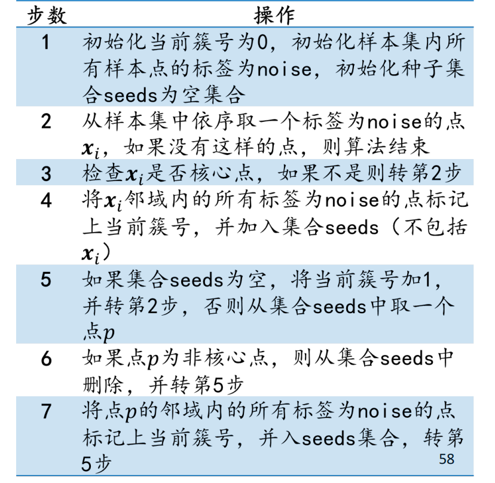

- **领域参数和Minpts的确定**

  设k_dist为某点p到离它第k近的那个邻居点点距离，可以计算每个点的k_dist值，将他们按照大小进行排序作图，根据拐点来确定epsilon，将epsilon设为拐点的k_dist值，Minpts设为k。

- **OPTICS**

  1. 点xi的核心距离

     只有核心点才有核心距离，且核心距离是使该点成为核心点的最小距离

  2. 点xi到点xj的可达距离

     只有核心点才能被可达，且可达距离是该核心点的核心距离或者两点间距离的最大值。

  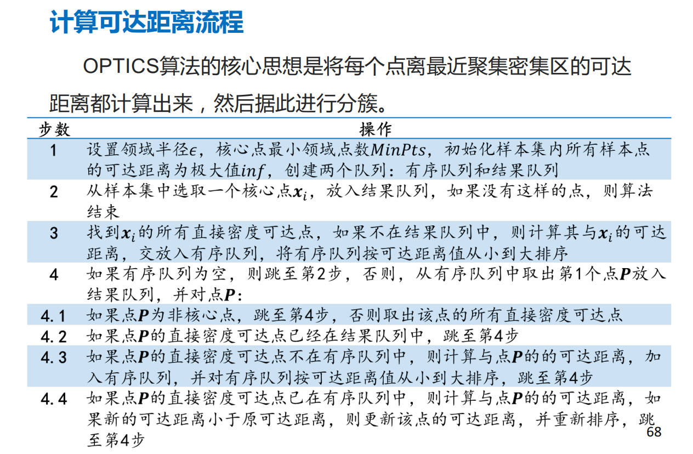

#### 层次聚类

*层次聚类强调的是聚类执行的过程，分为自底向上的凝聚方法和自顶向下的分裂方法，凝聚方法是先将每一个样本点当成一个簇，然后逐步合并，分裂方法是将所有样本点放到一个簇内，然后逐步分解。*

- **AGNES 算法（自底向上）**

  *首先，将样本中的每一个样本看做一个初始聚类簇，然后在算法运行的每一步中找出距离最近的两个聚类簇进行合并，该过程不断重复，直到达到预设的聚类簇的个数。*

  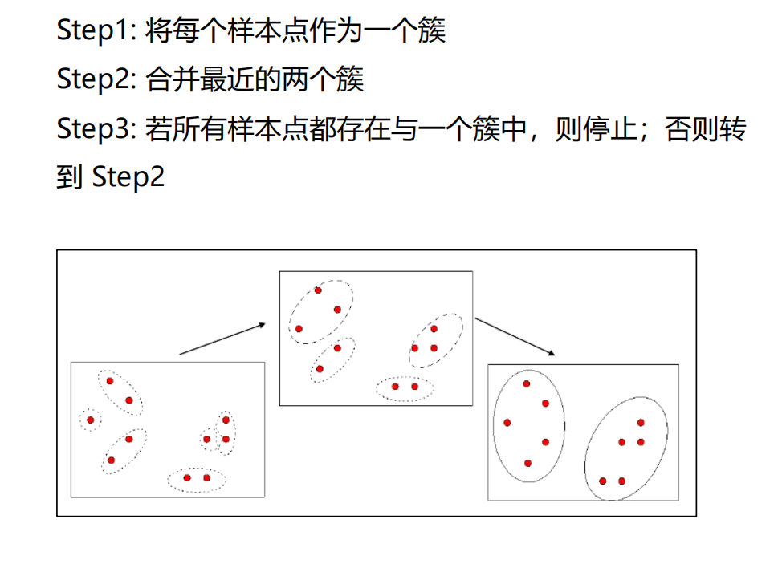

- **网格聚类**

  强调的是分批统一处理，具体的做法是将特征空间划分为若干个网格，将网格内的样本点看做一个单元进行处理。

- **其他常见聚类方法**

  - K 均值聚类
  - FCM
  - LVQ
  - 密度聚类：DBSCAN、OPTICS等
  - 层次聚类：AGNES、DIANA 等

### 主要考察方向

- **常见聚类方法**
  - k均值聚类，学习向量量化，高斯混合聚类
  - DBSCAN
  - AGNES

## 回归

### 回归任务、线性回归、回归指标

> 基于损失函数最小的思想，学习得到一个模型，该模型是从实例特征向量到实数的映射

$$
f(x)=W\cdot x^T+b
$$

- 回归评价指标

  - 残差：
    $$
    s=|y_i - f(x_i)|
    $$
  
- 残差(误差)平方：
    $$
    s_i^2=(y_i-f(x_i))^2
    $$
  
- 误差平方和(SSE)
  $$
  L(W)=s_1^2(W)+s_2^2(W)+\cdots+s_m^2(W)
  $$
  
- 均方误差(MSE)
    $$
    MSE=\frac{L(W)}{m}
    $$

### 最优化模型

- **数学模型**
  $$
  \min_{x\in R}f(x)\ \ s.t.\begin{cases}
  \text{h}_i(x)=0\\
  \text{g}_i(x)\le0
  													\end{cases}
  $$
  s.t.为subject to的缩写

- **迭代法**

  > 迭代法的核心是建立迭代关系式

  - 先将方程式f(x)=0变换为x=g(x)
  - 建立迭代关系式x_k+1=g(x_k)
  - 计算x_k,若收敛于x^\*,那么x^\*就是方程的跟

- **梯度下降法**
  $$
  x_{i+1} = x_i-\alpha\cdot \frac{df(x)}{dx}|_{x=x_i}
  $$

  - 结束条件：一般是迭代次数达到了最大设定，损失函数低于设定的阈值
  - 步长的设定
  - 特征归一化

  $$
  损失函数：L(W)=\frac{1}{2}\sum_{i=1}^ms_i^2(W)\\
  回归系数更新：w_{l+1}^{(j)}=w_i^{(j)}+\alpha \frac{dL(W)}{dw^{(j)}}
  $$

- **全局最优**

  Hessian矩阵
  $$
  f(x)=f(x_0)+(\frac{\part f}{\partial x^{(1)}},\frac{\part f}{\part x^{(2)}})_{x_0}\cdot \begin{pmatrix}
  \Delta x^{(1)}\\
  \Delta x^{(2)}
  \end{pmatrix}+\cdots
  $$
  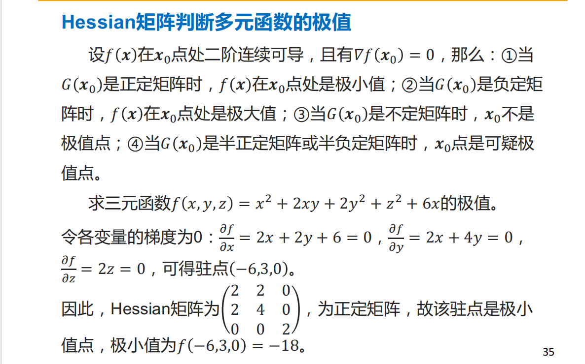

- 凸优化

  > 凸集的定义：集合内 S 中任意的两点的连线上的点都在 S 内，则称集合S 为凸集
  >
  > 凸函数：曲线上的任意两点连线上的所有点都在曲线上方
  >
  > 凸函数中局部最优点就是全局最优点

  - 凸函数的判定
    - 切线位于曲线下方
    - 二阶导数大于等于 0

- 牛顿法

  > 用所谓的切线来建立迭代关系

  $$
  x_{i+1}=x_i-\frac{f(x_i)}{f'(x_i)}
  $$

  ......

### 多项式回归

> 多项式回归，研究一个因变量与一个或多个自变量间多项式关系的回归分析方法。

- 转换为线性回归问题来解决

  $$
  y_1=x,y_2=x^2.....
  $$

### 欠拟合、过拟合、泛化能力

- 训练集、验证集、测试集

  训练集 的数据要尽可能充分且分布平衡

- 泛化能力评估方法

  - 留出法

  - K-折交叉验证

- 奥卡姆剃刀定律：越简单越好

- 过拟合抑制

  - 正则化方法：加一个正则化项，模型越复杂，值越大

  - L2 正则化方法：给它加一个参数向量 W 的 L2 范数

    采用 L2 范数和 L1 范数正则项的线性回归，分别称为岭回归和Lasso回归

  - 早停法：在每一轮训练完后，就用验证集来验证泛化能力，如果n轮训练后泛化能力都没有提高，就停止训练。

  - 随机失活：随机失活应用于神经网络的过拟合抑制，它通过随机使一部分神经元临时失效来达到目的。

### 向量相关性

> 用验证集的预测值组成的向量与实际标签值组成的向量之间的相关性来衡量算法的有效性

- **协方差**
  $$
  Cov(X,Y)=E\{[X-E(X)]\cdot [Y-E(Y)\}
  $$
  变化趋势相近时，协方差大于 0，如果相反，则小于 0，独立时，为 0

- **相关系数与相关距离**
  $$
  \rho_{XY}=\frac{Cov(X,Y)}{\sqrt{D(X)}\sqrt{(D(Y))}}
  $$

### 岭回归算法

> 岭回归算法是在原线性回归的损失函数上增加 L2 正则项

$$
L'=L(W)+\lambda WW^T
$$

通过权重对系数进行了衰减，抑制了相关特征的系数发生过大变化，迫使它们向 0 趋近，与简单 d 线性回归相比能取得更好的预测效果。

### Lasso 回归和 ElasticNet 回归

> Lasso回归和岭回归的区别在于Lasso回归的惩罚项是基于 L1 范数

> ElasticNet回归是对 Lasso 回归和岭回归的融合，惩罚项是 L1 和L2项的融合

$$
\lambda(\frac{1-\rho}{2}||W||_2^2+\rho||W||_1)
$$

### 局部加权线性回归

> 局部加权线性回归模型根据训练样本点与预测点的远近设立权重，离预测点越近的点的权重就越大

### K 近邻法

> K近邻法是一种简单而基本的机器学习方法，可用于求解分类和回归问题

**K 近邻法用于回归分为两步**

1. 根据d，找出k个距离x最近的样本，得到x的邻域N
2. 计算v(N)得到x的标签值

*d常用欧式距离，v常用求均值函数*

### 主要考察方向

- 计算 L1 范数和 L2 范数
  - L1 范数：向量中各元素的绝对值之和
  - L2 范数：向量中各元素的平方和然后求平方根
  
- **K 近邻法考察过计算题**
  
  注意其计算步骤

## 分类

> 分类，就是将某个事物判定为属于预先设定的有限个集合中的某一个的过程。

### 分类算法基础

- **平面上二分类的线性逻辑回归**
  $$
  通过一个线性方程来对样本点进行划分：
  \\f_W(x)=w^{(0)}\cdot x^{(0)}+w^{(1)}\cdot x^{(1)}+\cdots=W\cdot x=0
  $$

  - 单位阶跃函数

    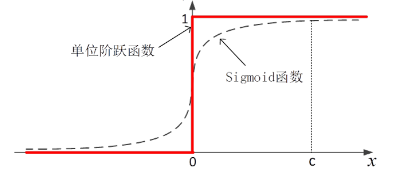

  - 损失函数
    $$
    L(W)=\sum_i|y_i-\hat{y_i}|
    $$

  - 梯度下降法求解
    $$
    W_{i+1}^{(j)}=W_i^j-\alpha\frac{\part L}{\part W_i^j}
    $$

### 逻辑回归模型

- **逻辑回归求解的步骤**

  - 确定一个合适的未知参数的预测函数（通过对样本的观察分析）
  - 根据预测函数设计损失函数
  - 通过某种方法从损失函数求出预测函数的未知参数

- **采用sigmoid函数作为分类函数**
  $$
  L_i(W)=\begin{cases}
  -ln(\hat{y_i}),if\ y_i=1\\
  -ln(1-\hat{y_i}),if \ y_i=0
  				\end{cases}
  $$

- **二分类逻辑回归未知样本的判定**
  $$
  P(y=1|x)=\frac{1}{1+e^{-f_\hat{W}(x)}}
  $$

- **发生比**
  $$
  样本取正类和负类概率的比值称为发生比：\frac{P(y=1|x)}{P(y=0|x)}=e^{f_\hat{W}(x)}
  $$

### 多分类逻辑回归

> 一对一：两两配对训练模型，在预测时将实例提交有关所有模型，最后投票其类别
>
> 一对其余：将一个看为正类，其余看为负类，训练出k个模型
>
> 多对多：将若干类作为正类，其余作为负类

- **多分类输出概率**
  $$
  P(y=1|x)=P(y=K|x)e^{f_{W_1}(x)}\\
  \cdots
  \\P(y=K-1|x)=P(y=K|x)e^{f_{W_{K-1}}(x)}
  $$

  $$
  P(y=K|x)=\frac{1}{\sum_{i=1}^{K-1}e^{fW_i(x)}+1}
  $$

- **Softmax函数**
  $$
  sofrmax函数将每一个分类结果转化为一个概率值：\\
  p_k=\frac{e^{y_k}}{\sum_{i=1}^ne^{y_k}},k=1,2\cdots,K
  $$
  **softmax还具有其归一化的功能，在神经网络中得到了非常广泛的应用**

### Softmax 回归模型

- **分类预测函数**
  $$
  p_k(x)=\frac{e^{W_k\cdot x}}{\sum_{k=1}^Ke^{W_k\cdot x}}
  $$

- **损失函数**
  $$
  L(W)=-\sum_{i=1}^m\sum_{k=1}^KI(y_i=y_k)ln\frac{e^{W_k\cdot x}}{\sum_{k=1}^Ke^{W_k\cdot x}}
  $$

- **梯度下降法求解**
  $$
  W_{j+1}=W_j-\alpha\cdot \frac{\part L(W)}{\part W_j}
  $$

- **Softmax回归与逻辑回归的关系**

  Softmax回归可看作二分类逻辑回归在多分类问题上的推广

### 线性判别分析(LDA)

> 同类样例的投影点尽可能接近，让同类样例投影点的协方差尽可能小
>
> 欲使异类样例的投影点尽可能远离，可以让类中心之间的距离尽可能大

- **最大化目标**
  $$
  J=\frac{w^T(\mu_0-\mu_1)(\mu_0-\mu_1)^Tw}{w^T(\sum_0+\sum_1)w}
  $$

### 多分类学习

> 多分类学习方法，将二分类学习方法推广到多类

- 一对一

  - N 个类别两两配对
  - 各个二类任务学习分类器
  - 投票产生最终分类结果

- 一对其余

  - 某一类作为正例，其他反例
  - 各个二类任务学习分类器
  - 置信度最大类别作为最终类别

- **两种策略比较**

  - 一对一：存储开销和测试时间大，训练时间短
  - 一对其余：存储开销和测试时间小，训练时间长

- 多对多

  **纠错输出码(ECOC)**:

  - 海明距离：比较样本与类的编码，不一致的个数就是海明距离
  - 欧氏距离：样本与类的差的平方和再加根号

### 类别不平衡问题

- 欠采样法

  直接对训练集中的过多样本去掉一部分

- 过采样法

  增加一些样本，简单的复制插值等

- 阈值移动法

  根据正负样本的数量对阈值进行移动

### 主要考察方向

- 训练逻辑回归使用的方法

  极大似然估计

## 决策树

### 决策树分类算法

- **基本思想**

  生活中常用决策树的思想来做决定。

- **决策树模型**

  - 决策树是一种对测试样本进行分类的树形结构，该结构由结点和有向边组成。
  - 内部结点表示对样本的一个特征进行测试
  - 叶结点表示样本的一个分类

- **建立二叉决策树流程**

  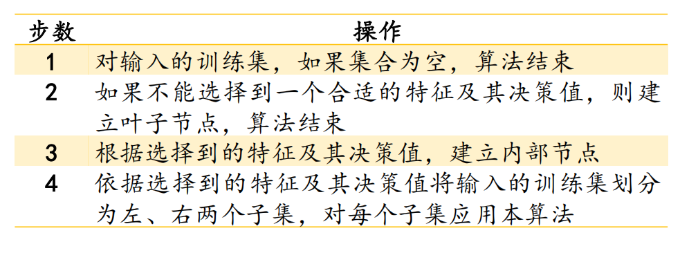

- **信息量**

  *信息就是对不确定性的消除*

  > 因此预言以往发生小概率的事件的消息所带来的信息量就要大，以往发生的概率叫做先验概率，用p表示

  $$
  信息量公式：I(x)=\log(\frac{1}{p})=-\log p
  $$

- **信息熵**

  > 把信源发出的所有事件的信息量求平均值，就可以刻画信源消除的平均不确定性，定义为信息熵

  $$
  Ent(X)=E[I(x_i)]=-\sum_{i=1}^np_i\log_2p_i
  $$

  **样本集合的信息熵越大，说明各样本相对均衡，区别度就越小**

- **信息增益**

  > 将样本集划分为 两个的信息熵，按样本比例作加权的和：

  $$
  Ent(D,F^{(j)}=f)=\frac{|D_1|}{|D|}Ent(D_1)+\frac{|D_2|}{|D|}Ent(D_2)
  $$

  > 划分前后信息熵的减少量称为信息增益

  $$
  Gain(D,F^{(j)}=f)=Ent(D)-Ent(D,F^{(j)}=f)\\=Ent(D)-(\frac{|D_1|}{|D|}Ent(D_1)+\frac{|D_2|}{|D|}Ent(D_2))
  \\=Ent(D)-\sum_{v=1}^V\frac{|D^v|}{|D|}Ent(D^v)
  $$

- **增益率**

  > 使用信息增益来选择特征时，算法会偏向于取值多的特征，也就是说取值越多可能会使信息增益越大，但并没有实际意义，故引入增益率

  $$
  GainRatio(D,F^{(j)})=\frac{Gain(D,F^{(j)})}{SplitInfo(F^{(j)})}
  \\其中：SplitInfo(F^{(j)})=-\sum\frac{|D_i|}{|D|}\log_2\frac{|D_i|}{|D|}(D_i是依据特征 F^{(j)}的取值划分的样本子集)
  $$

- **基尼指数**
  $$
  对于样本集D，其基尼指数为:Gini(D)=1-\sum_{k=1}^K(\frac{|D_k|}{|D|})^2=1-\frac{\sum_{k=1}^K|D_k|^2}{|D|^2}
  $$

  $$
  将样本集D 划分为独立的两个子集 D_1和D_2,其基尼指数为：\\
  Gini(\{D_1,D_2\})=\frac{|D_1|}{|D|}Gini(D_1)+\frac{|D_2|}{|D|}Gini(D_2)
  $$

### 连续值与缺失值

- **连续值处理**

  >连续属性离散化，常见做法：二分法

- **缺失值处理**

  - 仅通过无缺失值的样例来判断划分属性的优劣

- **多叉决策树**

  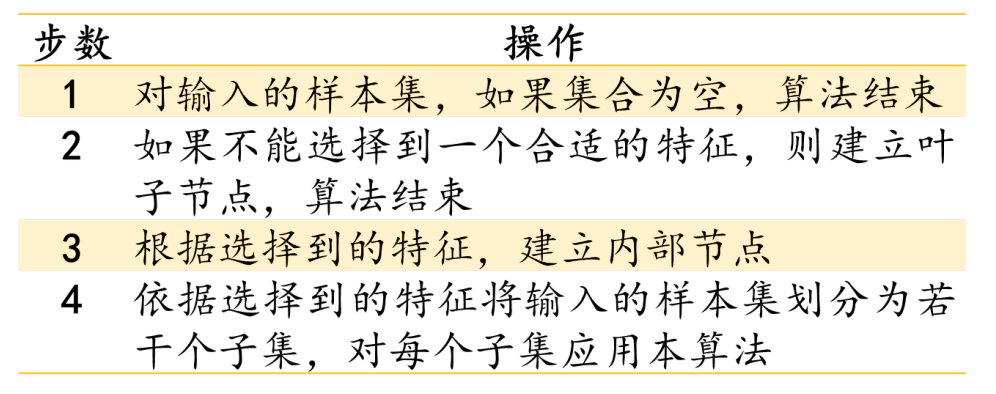

- **随机森林算法**

  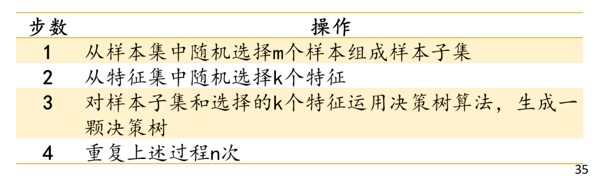

### 预剪枝与后剪枝处理

- **预剪枝**

  判断某个结点是否划分，计算不划分的精度，再计算划分的精度，从而决定是否对该树进行剪枝。
  
  **优点**
  
  - 降低过拟合风险
  - 显著减少训练时间和测试时间开销
  
  **缺点**
  
  - 欠拟合风险
  
- **后剪枝**

  先从训练集生成一颗完整的决策树，然后自底向上地对非叶结点进行考察，若将该结点对应的子树替换为叶结点能带来决策树泛化性能提升，则将该子树替换为叶结点
  
  **优点**
  
  后剪枝比预剪枝保留了更多的分支，欠拟合风险小，泛华性能优于预剪枝
  
  **缺点**
  
  训练时间开销大

### 回归树

> 树模型解决回归问题的基本思想是将样本空间切分为多个子空间，在每个子空间中单独建立回归模型

- **CART树生成**

  > 在回归问题中，标签值是连续的，将扎堆样本分在一起更合理些，所以使得切分的两个子集的方差和最小的那个值，称为最小剩余方差

  **最小剩余方差**
  $$
  \sum_{i=1}^k(y_i-\hat{y_1})^2+\sum_{i=k+1}^m(y_i-\hat{y_2})^2
  $$
  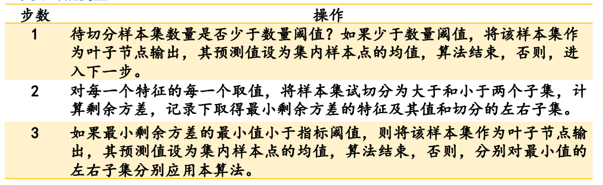

### 多变量决策树

> 按照普通决策树，画出的图像是通过与轴平行的几条线来进行分割的，但是多变量决策树可以加入权重的一个线性组合

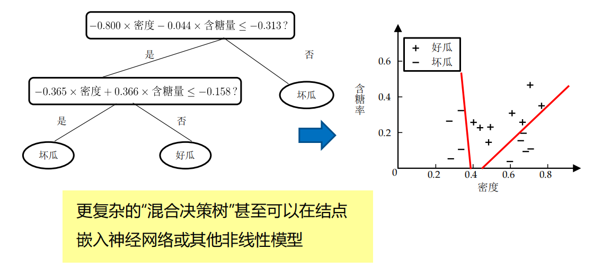

### 主要考察方向

- 计算信息增益

  

  

- 例题1

  

- 例题 2

  

- 增益率

  PPT 无样例，后期有时间增加

- 基尼指数

  

## 贝叶斯分类

### 概率模型

- 条件概率
  $$
  P(B|A)=\frac{p(AB)}{P(A)}
  $$

- 贝叶斯公式
  $$
  P(A_k|B)=\frac{P(A_k)\cdot P(B|A_k)}{\sum_{i=0}^nP(A_i)\cdot P(B|A_i)}(也称为后验概率)
  $$

- 贝叶斯决策论
  $$
  条件风险：R(c_i|x)=\sum_{j=1}^N\lambda_{ij}P(c_j|x)
  \\
  h^*(x)=argmin_{c\in y}R(c|x)
  \\
  \lambda_{i,j},当i=j的时候等于 0，其余等于 1
  $$

### 朴素贝叶斯分类器

> 朴素贝叶斯分类是基于贝叶斯定理与特征条件独立假定的分类方法

- **先验概率**
  $$
  对某一标签值y^{(1)},其先验概率为 P(Y=y^{(i)}),\\在标签取值y^{(i)}时 X 为某一x的条件概率为 P(X=x|Y=y^{(i)})
  $$

- **后验概率**
  $$
  P(Y=y^{(1)}|X=x)=\frac{P(X=x,Y=y^{(i)})}{P(X=x)}
  \\=\frac{P(X=x|Y=y^{(l)})P(Y=y^{(l)})}{\sum_j^kP(X=x|Y=y^{(j)})P(Y=y^{(j)})}
  $$

- **估计先验概率**
  $$
  p_i是事件 Y=y^{(l)}发生的概率，不发生的概率为1-p_i
  \\似然函数：L(p_i)=\prod_{i=1}^{M_i}p_i\cdot \prod_{i=1}^{m-M_i}(1-p_i)
  \\=p_i^{M_i}(1-p_i)^{m-M_i}
  \\对两边加\ln，然后对p_i求导，等于零
  \\求得p_l=\frac{\sum_{i=1}^mI(y_i=y^{(l)})}{m}
  $$
  
- **估计条件概率**
  $$
  P(X^{(1)}=x^{(1)},X^{(2)}=x^{(2)}\cdots|Y=y^{(l)})
  \\=\frac{P(X^{(1)}=x^{(1)},X^{(2)}=x^{(2)}\cdots,Y=y^{(l)})}{P(Y=y^{(l)})}
  $$
  
- **条件独立性假定下的条件概率**
  $$
  P(X^{(1)}=x^{(1)},X^{(2)}=x^{(2)}\cdots|Y=y^{(l)})
  \\=P(X^{(1)}=x^{(1)}|Y=y^{(l)})P(X^{(2)}=x^{(2)}|Y=y^{(2)})\cdots
  \\=\prod_{j=1}^nP(X^{(j)}=x^{(j)}|Y=y^{(l)})
  $$

  $$
  P(X^{(j)}=x^{(j)}|Y=y^{(l)})=\frac{\sum_{i=1}^mI(X_i^{(j)}=x^{(j)},y_i=y^{(l)})}{\sum_{i=1}^mI(y_i=y^{(l)})}
  $$
  
- **生成式模型**
  $$
  P(c|x)=\frac{P(x,c)}{P(x)}=\frac{P(c)P(x|c)}{P(x)}
  $$
  
- **极大似然估计**
  
  > 我们的任务就是通过训练集 D，来估计参数
  
  - 频率主义学派
  
    > 参数虽然未知，但却存在客观值，因此可通过优化似然函数等准则来确定参数值
  
  $$
  P(D_c|\theta_c)=\prod_{x\in D_c}P(x|\theta_c)
  \\上式的连乘操作容易造成下溢，通常使用对数似然
  \\LL(\theta_c)=\log P(D_c|\theta_c)=\sum_{x\in D_c}\log P(x|\theta_c)
  \\\theta_c=arg \max LL(\theta_c)
  $$
  
  - 贝叶斯学派
    
    > 认为参数是未观察到的随机变量，因此可以假定参数服从一个先验分布
    
    $$
    \mu_c=\frac{1}{|D_c|}\sum_{x\in D_c}x
    \\ \sigma_c^2=\frac{1}{|D_c|}\sum_{x\in D_c}(x-\mu_c)(x-\mu_c)^T
    $$
  
- **朴素贝叶斯分类器**
  
  > 朴素贝叶斯采用了“属性条件独立性假设”每个属性独立地对分类结果发生影响
  
  $$
  对于所有类别来说P(x)相同，因此贝叶斯判定准则有：
  \\h_{nb}(x)=argmax_{c\in y}P(c)\prod_{i=1}^d P(x_i|c)
  $$
  
  - **一些计算步骤**
    $$
    -\ \ \  P(c)=\frac{|D_c|}{D}
    \\-离散属性\ \ \ P(x_i|c)=\frac{|D_{c,x_i}|}{D_c}
    \\-连续属性\ \ \ P(x_i|c)=\frac{1}{\sqrt{2\pi}\sigma_{c,i}}exp(-\frac{(x_i-\mu_{c,i})^2}{2\sigma_{c,i}^2}
    $$
  
- **多项式朴素贝叶斯分类器**

  > 在用极大似然法对后验概率进行估计时，假设先验概率和条件概率服从多项式分布

  $$
  先验概率变为：P(Y=y^{(l)})=\frac{\sum_{i=1}^mI(y_i=y^{(l)})+\alpha}{m+k\alpha}
  \\条件概率的估计变为：P(X^{(j)}=x^{(j)}|Y=y^{(l)})=\frac{\sum_{i=1}^mI(x_i^{(j)},y_i)+\alpha}{\sum_{i=1}^mI(y_i=y^{(l)})+S_j\alpha}
  $$

- **高斯朴素贝叶斯分类器**

  > 只是把正态分布变为了高斯分布

  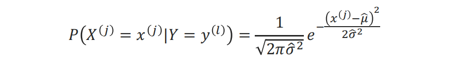

### 半朴素贝叶斯分类器

> 为了降低贝叶斯公式中后验概率的困难，朴素贝叶斯分类器采用的属性条件独立假设，若对属性条件独立假设进行一定程度的放松，就是半朴素贝叶斯分类器

- SPODE：假设所有属性都依赖于同一属性，称为“超父”，然后通过交叉验证等模型选择方法来确定超父属性

- TAN：以属性间的条件“互信息”为边的权重，构建完全图，再利用最大带权生成树算法，仅保留强相关属性间的依赖性

  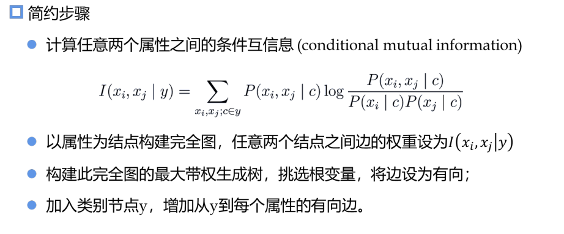

- AODE

  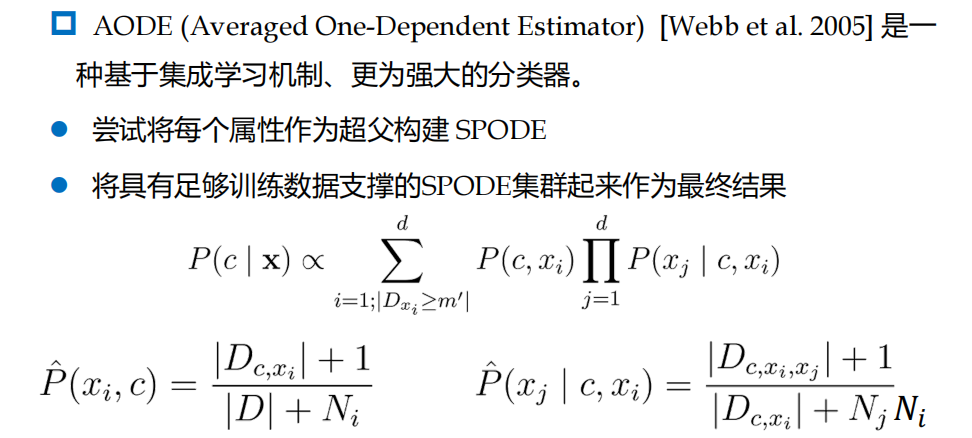

- 贝叶斯网

  > 贝叶斯网络中的节点表示随机变量，有向边表示变量之间有因果关系(非条件独立)，两个用箭头连接的节点就会产生一个条件概率值

  **每一个节点在其直接前驱节点的值制定后，这个节点条件独立于其所有非直接前驱前辈节点。**

  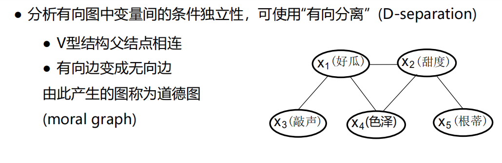
  
  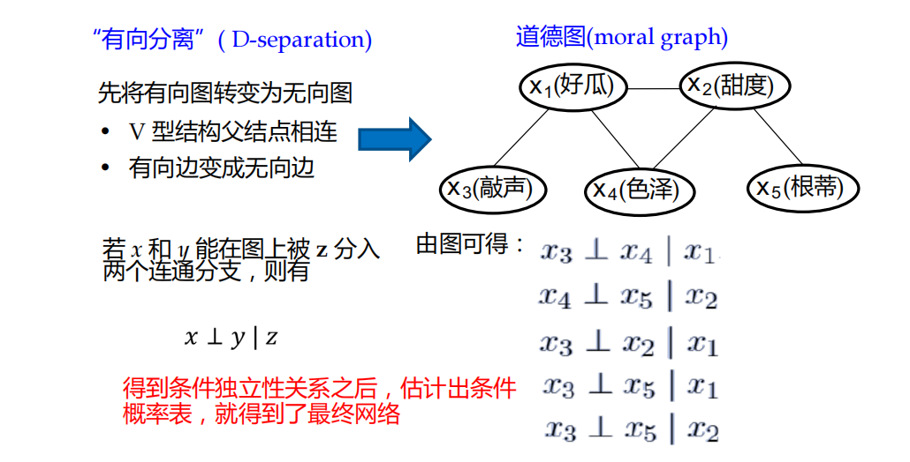
  
  - 结构学习：最小描述长度评估贝叶斯网与训练数据的契合程度
  
  - 推断：基于已知属性变量的观测值，推测其他属性变量的取值
  
    **近似推断：吉布斯采样**（直觉不考）
  
    

### EM 算法

>在某些情况下，模型中含有无法明确观察到的隐参数，则无法直接用极大似然法来估计模型参数

它的基本思想是求期望和求极大化的逐步迭代。它先假定隐参数的值，然后基于已经观察到的样本数据和该假定，用极大似然法来估计其它参数。

### 主要考察方向

- **样例**

  

  

  

  

- **样例 1**

  

- **样例 2**

  

  

##  集成学习

### 个体与集成

> 集成学习通过构建并结合多个学习器来提升性能

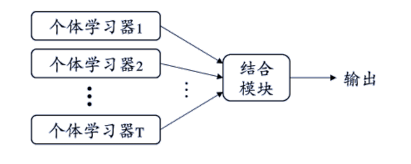

- **简单分析**

  **考虑二分类问题，假设基分类器的错误率为**

  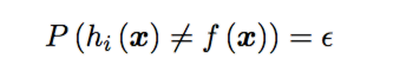

  - 假设集成通过简单投票法结合 T 个分类器，超过半数的基分类器正确则分类就正确

  - 假设基分类器的错误率相互独立，则由Hoeffding不等式可得集成的错误率为
    $$
    P(H(x)\neq f(x))\le \exp(-\frac{1}{2}T(1-2\epsilon )^2)
    $$
  
  - 上式显示，在一定条件下，随着集成分类器数目的增加，集成错误率将指数级下降，最终趋向于 0
  
- **成功的集成学习方法**

  - 序列化方法：AdaBoost
  - 并行化方法：Bagging
  

### **Boosting**

> 个体学习器存在强依赖关系
>
> 串行生成
>
> 每次调整训练数据的样本分布

- **Boosting算法**

  

- **AdaBoost算法**

  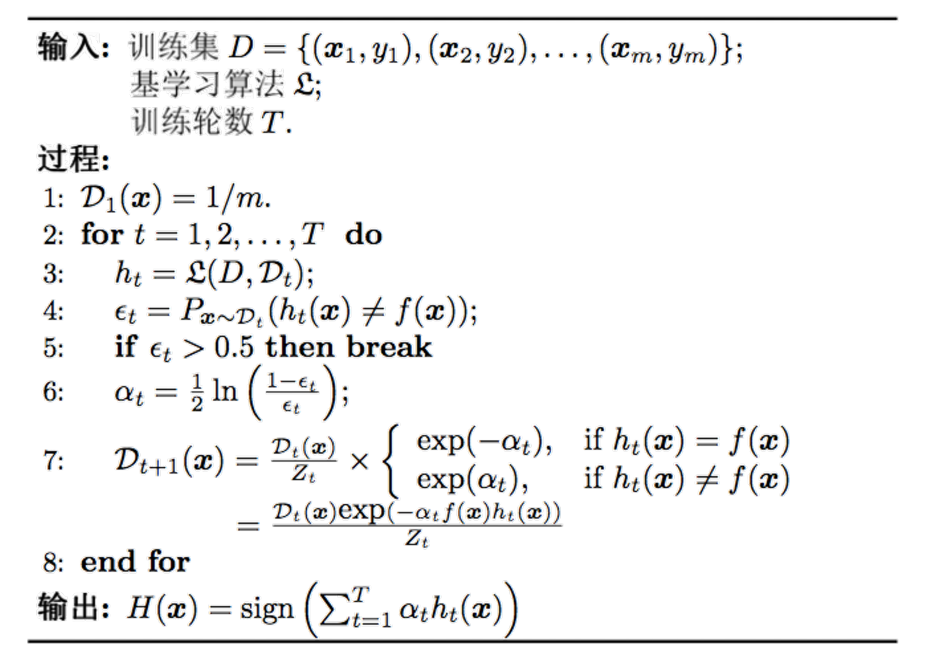

### Bagging与随机森林

> 个体学习器不存在强依赖关系
>
> 并行化生成
>
> 自助采样法

- **Bagging算法**

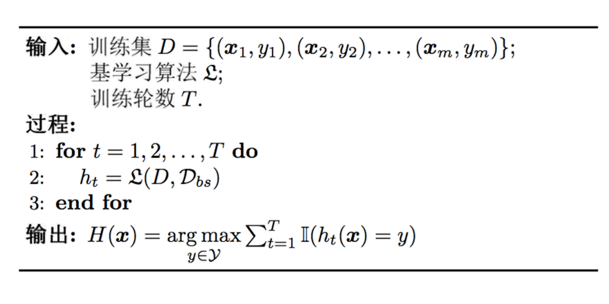

- **随机森林**

  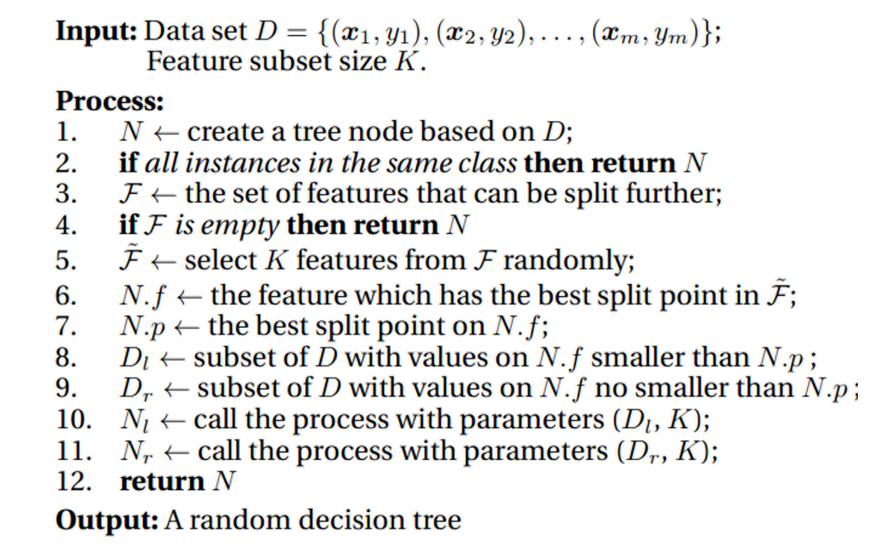

### 结合策略

- 投票法
  - 绝对多数投票法
  - 相对多数投票法
  - 加权投票法

- 平均法
  - 简单平均法
  - 加权平均法

- 学习法

### 多样性

- **误差-分歧分解**

## 支持向量机

### 间隔与支持向量

- **间隔**
  $$
  点与超平面的距离为：\gamma_1=\frac{\omega}{||\omega||}\cdot x_i+\frac{b}{||\omega||}
  \\超平面两类之间的间隔为：\gamma=\frac{2}{||\omega||}
  \\最大间隔：寻找参数\omega和b，使得\gamma最大
  \\argmin\frac{1}{2}||\omega||^2
  $$
  
- **最大间隔超平面的存在唯一性**

- **实例**

  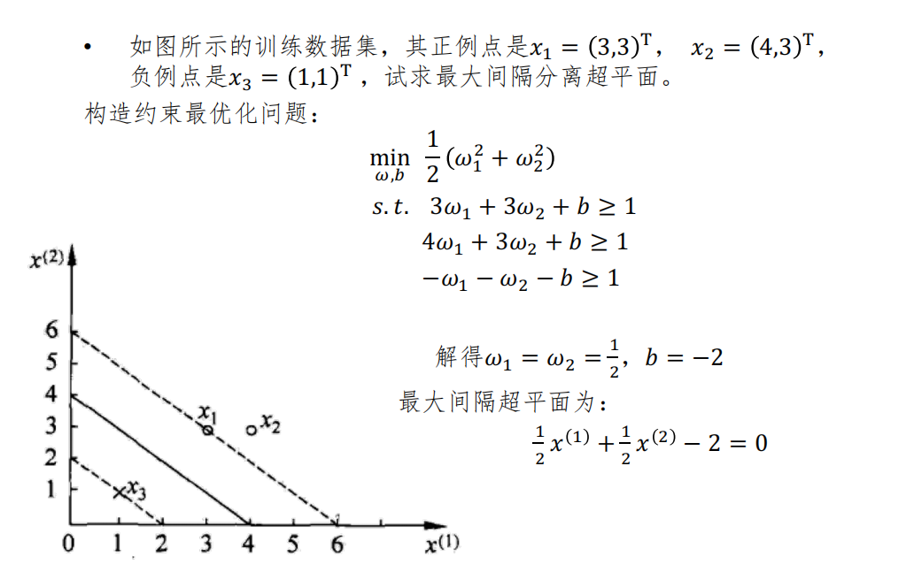

### 对偶问题

- **拉格朗日乘子法**

  - 第一步：引入拉格朗日乘子\alpha得到拉格朗日函数
  - 第二步：令拉格朗日函数对w和b的偏导为 0
  - 第三步：回代

- **线性可分支持向量机学习算法**

  - 第一步：构造并求解约束最优化问题

    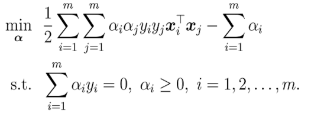

  - 第二步：计算w和b

  - 第三步：求得分离超平面

- **实例**

  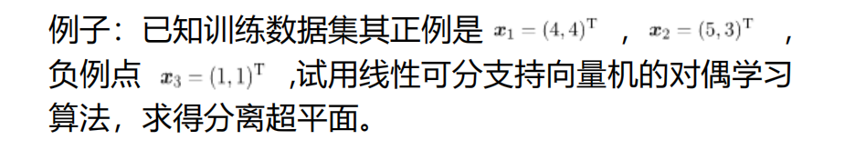

  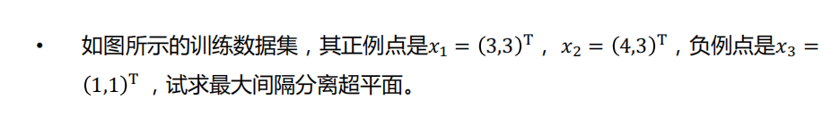

- **解的稀疏性**

  > 训练完成后，大部分的训练样本都不需要保留，最终模型仅与支持向量有关

  KKT 条件

  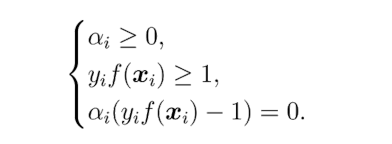

### 软间隔

> 允许支持向量机在一些样本上不满足约束

- **0/1损失函数**

  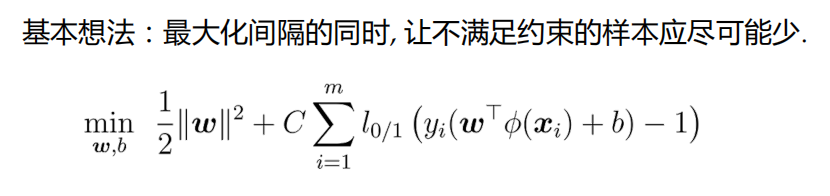

- **软间隔支持向量机**

  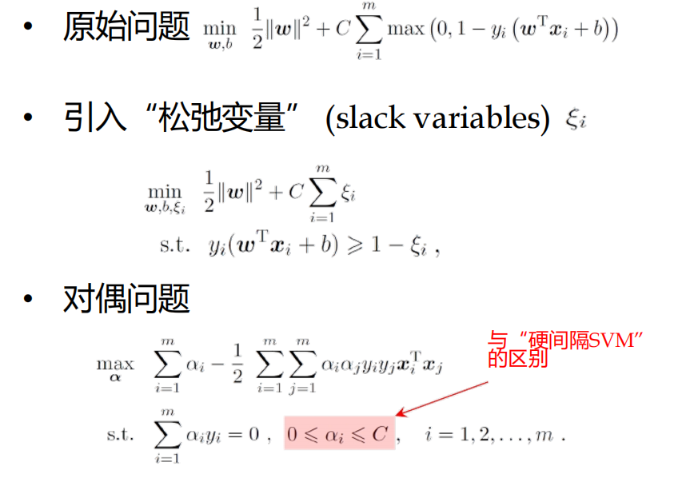

  **C 越大，越容易过拟合**

- **正则化**

  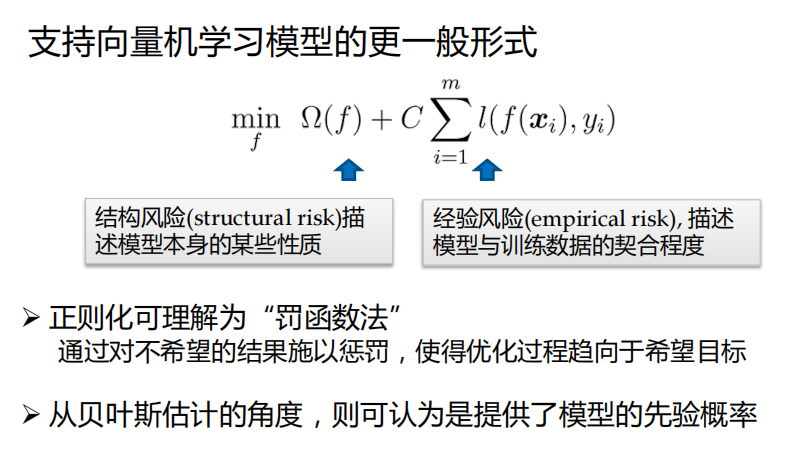

- **序列最小最优化算法(SMO)**

  *如果所有变量的解都满足此最优化问题的 KKT 条件，那么可以得到这个最优化问题的解*

  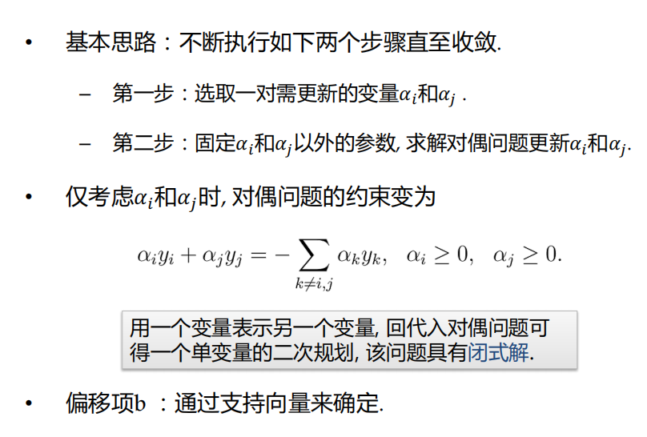

- **SMO 算法**

  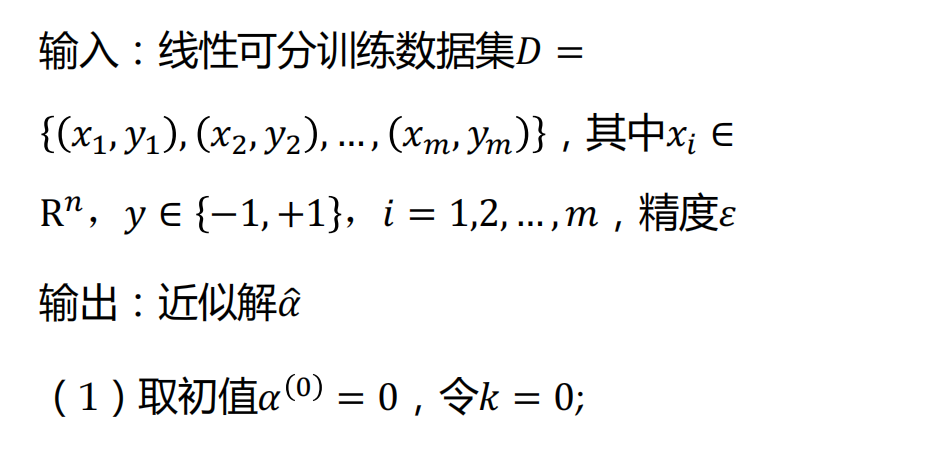

  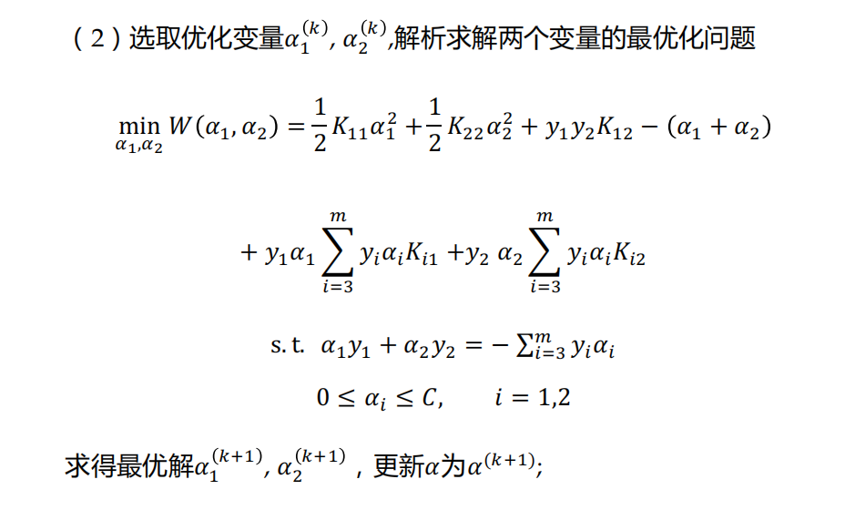

  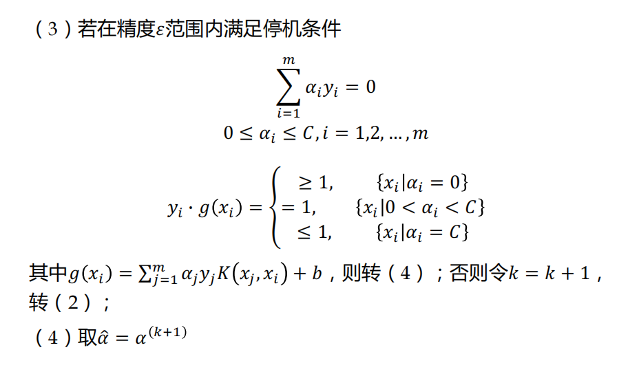

### 核函数

> 如果原始空间是有限维，那么一定存在一个高维特征空间使样本可分

- 基本想法：不显式地设计核映射，而是设计核函数

  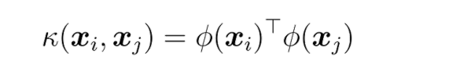

- Mercer定理：只要一个对称函数所对应的核矩阵半正定，则它就能作为核函数来使用

- 常用核函数

  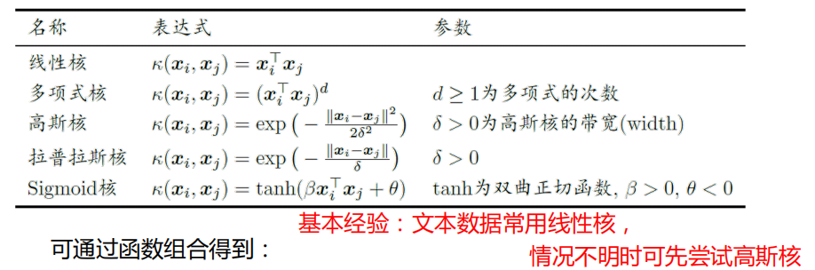

- 非线性支持向量机学习算法

  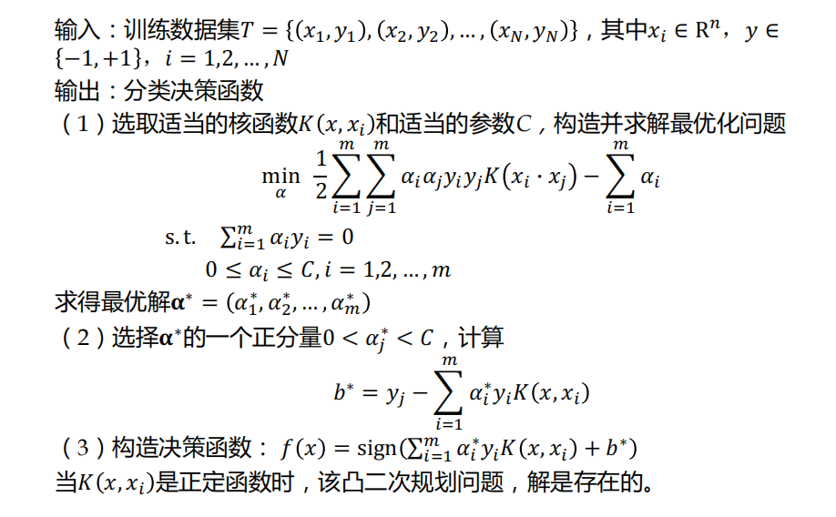

### 支持向量回归

> 支持向量回归允许模型输出和实际输出间存在 2\sigma的误差

- **损失函数**

  落入中间2\sigma间隔带的样本不计算损失，从而使模型获得稀疏性

  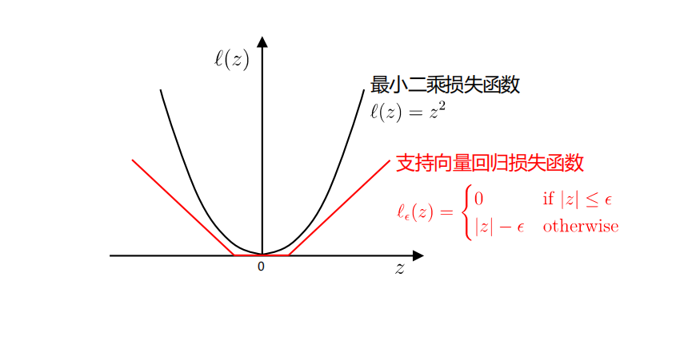

- **形式化**

  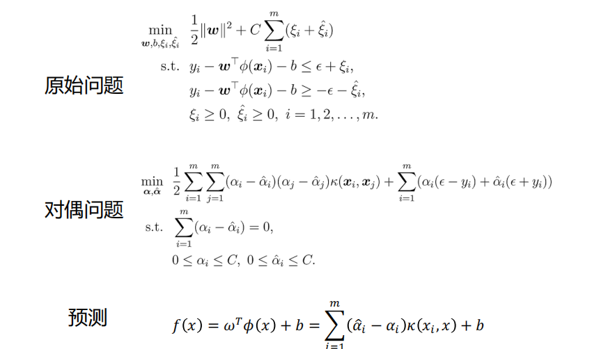

  

### 核方法

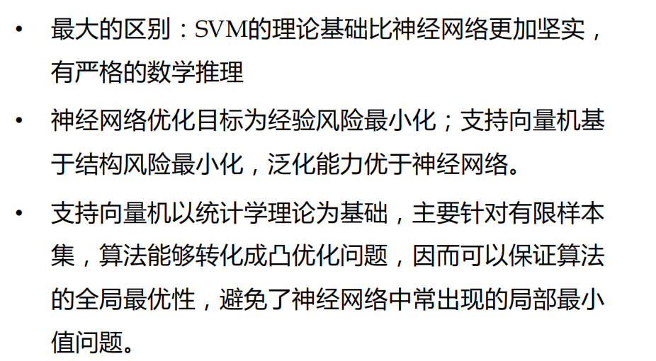

### 主要考察方向

- **样例计算**

  

  

- 样例 2

  

- 例题

  

## 神经网络

### 神经网络发展史

### 神经元模型

> 神经网络是由具有适应性的简单单元组成的广泛并行互联的网络, 它的组织能够模拟生物神经系统对真实世界物体所作出的反应

- M-P模型

  

- 激活函数

  - 阶跃函数

    

  - Sigmoid函数

    

    g'(x)=g(x)(1-g(x))

  - ReLu函数

    f(x)=max(0,x)

- 感知机模型

  > 感知机模型是二分类的线性分类模型，它能对空间中线性可分的二分类样本点进行划分。

  $$
  y=u(\sum_{i=1}^nw^{(i)}x^{(i)}-\theta)=u(W\cdot x^T-\theta)
  $$

  

  - 感知机学习
    $$
    w_i\leftarrow w_i+\vartriangle w_i
    \\\vartriangle w_i=\eta(y-\hat{y})x_i
    $$

  - 学习率

    学习率太小，收敛就非常慢

    学习率太大，就可能导致网络的瘫痪和不稳定

    自适应学习率

### 多层神经网络

- 多层前馈神经网络

- 误差逆传播算法

  

  - 标准 BP 算法：每次针对单个训练样例更新权值与阈值
  - 累计 BP 算法：最小化整个训练集上的累计误差

- 多层神经网络常用损失函数

  - 相对熵损失函数和交叉熵损失函数
    $$
    H(y,p)=-[y\log p+(1-y)\log(1-p)]
    $$

  - 余弦相似度损失函数
    $$
    \cos\theta=\frac{x_i\cdot x_j}{||x_i||\cdot||x_j||}
    $$

  - 双曲余弦对数损失函数
    $$
    logcosh(p,q)=\sum_{i=1}^n\log{\frac{e^{q_i-p_i}+e^{-(q_i-p_i)}}{2}}
    $$

- 多层神经网络常用优化算法

  - 动量优化算法

    加入动量之后的前进量是上一步的前进量和新梯度值

  - 步长优化算法

    随着迭代次数的增加，步长越来越小，可以防止在极小值附近来回振荡

  - 结合动量和步长优化算法

- 多层神经网络中过拟合的抑制

  - 正则化
  - 早停法
  - Dropout法

- 进一步讨论

  - 局部收敛
    - 模拟退火：每一步都以一定概率接受比当前解更差的结果
    - 随机梯度下降：在计算梯度时加入随机因素
    - 遗传算法：常用来训练神经网络
  - 梯度消散和梯度爆炸

### 其他常见神经网络

- RBF网络

  >RBF 网络是一种单隐层前馈神经网络, 它使用径向基函数作为隐层神经元激活函数, 而输出层则是隐层神经元输出的线性组合. 

- ART 网络

  > ART网络性能依赖于识别阈值

- 自组织映射(SOM)网络

  >SOM 网络是一种竞争型的无监督神经网络, 它能将高维数据映射到低维空间（通常为2维）, 同时保持输入数据在高维空间的拓扑结构, 即将高维空间中相似的样本点映射到网络输出层中邻近神经元

- 级联相关网络

  >级联相关网络不仅利用训练样本优化连接权值, 阈值参数, 将网络的结构也当做学习的目标之一, 希望在训练过程中找到适合数据的网络结构.

- Elman网络

  递归神经网络

- Boltzmann机

  >神经网络中有一类模型为网络定义一个“能量”, 能量最小化时网络达到理想状态, 而网络的训练就是在最小化这个能量函数. 

## 深度学习

### 概述

- **深度学习与神经网络**
  - 相同点：二者均采用分层结构，包括输入层、输出层组成的多层网络
  - 不同点：神经网络采用 BP 算法调整参数，采用迭代法训练整个网络，深度学习采用逐层训练机制，采用该机制的原因在于如果采用 BP，残差传到最前面会很小
- **神经网络的局限性**
  - 比较容易过拟合，参数比较难调整
  - 训练速度慢，层次较小的情况下效果不比其它方法更优

### 卷积神经网络

- **复杂模型训练方法**

  预训练+微调

  权共享

  卷积神经网络

- **卷积神经网络**

  - 卷积层
  - 采样层
  - 连接层

- **卷积层**

  > Tensor是图片组成的多维数据

  1. 一般会设置多个卷积核，将图片的长宽变小，厚度增加
  2. 如果待处理张量规模很大，可以将卷积核由依次移动改为跳跃移动
  3. 为了提取到边缘的特征，可以在待处理张量的边缘填充 0 再进行 juanji

- **池化层和Flatten层**

  1. 池化层与卷积层类似，只不过卷积核只取对应位置的最大值或平均值，分别称为最大池化或平均池化
  2. Flatten层，只是将输入的多维数据拉成一维的

- **典型卷积神经网络**

  1. VGG-16,VGG-19

  2. 残差网络

     提出了抑制退化和梯度消散，加速训练收敛的方法

### 循环神经网络

> 循环神经网络是用于对序列的非线性特征进行学习的深度神经网络

- **基本单元**

  类似于隐马尔可夫，把循环神经网络中间部分称为隐层，隐层的输出有两个一个是y，另一个反馈到自身

- **网络结构**

  - One to many
  - many to one
  - Many to many

- **长短时记忆网络**

  遗忘门用来控制上一步的状态输入到本步的量，也就是遗忘了上一步的状态的程度

## 结束语

> **Open source is a spirit that arises for freedom and equality.**
>
> *如发现内容错误，请联系编辑者进行修正，该内容仅针对2023级的重点，但每年的核心应为固定的*
>
> E-mail:2303112308@qq.com
>
> File Source Address:https://wr0519.github.io/moan-blog/#/
